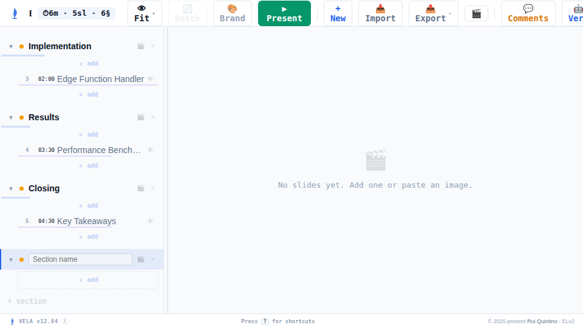
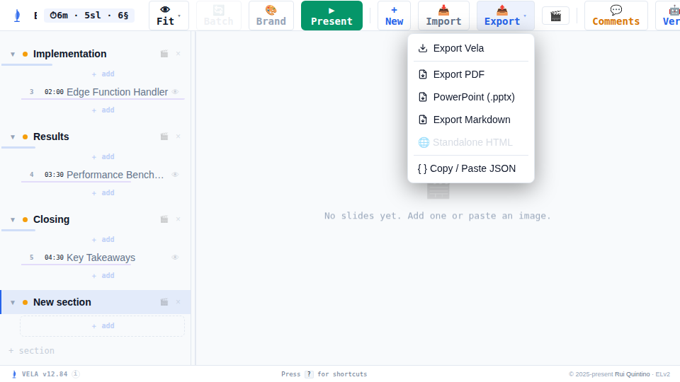
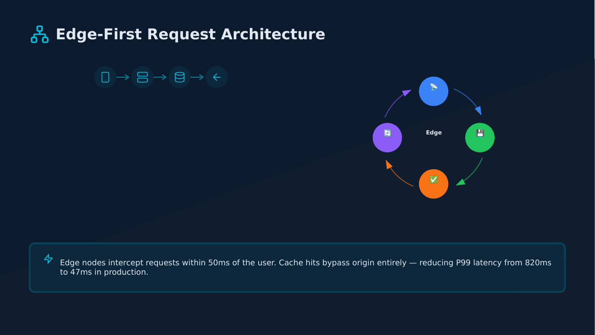

# Sprint "Envoy" — Native PowerPoint (.pptx) Export

**Theme:** Interchange — hand a Vela deck to anyone, as native PowerPoint.
**Base:** `main` @ `4226b1a` → **Branch:** `claude/powerpoint-export-feature-jhuc8c` @ `d817e45`
**Spec:** [`sprint-2026-07-04-1-envoy.md`](../../sprint-2026-07-04-1-envoy.md) · **Plan:** [`plan-2026-07-06-envoy.md`](./plan-2026-07-06-envoy.md)

## Scope

Ship a client-side, in-artifact PowerPoint export producing **native, editable**
objects (retype text, restyle shapes) at vector-PDF fidelity — not a flattened
picture. Six change requests (PPTX-1..6): core exporter, native SVG/vector
embed, tables & images, fidelity (gradients/colors/fonts), UI wiring, and
tests/version/CI.

## What shipped

- **`part-pptx.jsx`** (new, ~830 lines): `buildPptx(pages, opts)` — text runs as
  real `<a:r>` runs in reflowable text boxes, roundRect/ellipse autoshapes,
  full-bleed solid/gradient backgrounds, hyperlinks, native `<a:tbl>` tables,
  embedded `<p:pic>` images, and inline `<svg>` diagrams (Lucide icons, flow/
  cycle diagrams) embedded as native `asvg:svgBlip` pictures with a
  browser-rasterized PNG fallback for pre-365 PowerPoint clients.
- **Export → "PowerPoint (.pptx)"** menu entry + `PptxExportModal`, mirroring
  the existing PDF export UX (choose → exporting → done, optional "Made with
  Vela" branding, thumbnails, base64 `data:` URI download).
- **`tests/test_pptx_export.cjs`**: a real Playwright-driven e2e test exercising
  the actual export UI against a real deck, plus an opportunistic `python-pptx`
  structural read-back in `test_vela.py` (gracefully skips if unavailable).
- `VELA_VERSION` 12.83 → **12.84**, CI wired to install `python-pptx` and run
  the new e2e suite.

**Design decision, made during the build (not in the original spec):**
production `part-pptx.jsx` wires directly to `part-pdf.jsx`'s existing, already-
correct DOM extractors (`extractBoxes`, `extractCircles`, `extractLinks`,
`parseLinearGradient`, `slideHasImages`) instead of porting the throwaway
spike's own from-scratch extraction — recon found every one of the spike's 5
baseline bugs was a regression specific to *that* reimplementation, not a flaw
in the production extractors or the OOXML emitter. Only the emitter itself and
a new per-element (not per-line) text extractor were newly written.

## Agentic burndown

| Stage | What happened |
|---|---|
| Recon (3 parallel agents) | Mapped the spike, `part-pdf.jsx` reusable primitives, and UI/build/test anchors — found the spike's extraction bugs were locally-scoped, not shared |
| Build: PPTX-1 (core) | Foundation — text/shapes/bg/links; fixed 4 of the spec's 5 baseline bugs at the root |
| Build: PPTX-2 + PPTX-5 (parallel, worktree) | SVG embed · Export menu/modal wiring — disjoint files, merged clean |
| Build: PPTX-3 | Tables & images, raster hybrid |
| **+1 fix** | Table detection used a DOM heuristic (bordered-grid scan) instead of the existing `data-block-type` marker — simplified to the reliable selector |
| Build: PPTX-4 | Gradients/alpha/fonts fidelity |
| Build: PPTX-6 | e2e test, version bump, CI |
| Fix-round hunt (1 hunter, 3 min, engine-enforced) | **+2 fixes**: multi-line text fused across ` ` breaks; ragged table rows emitted malformed `<a:tr>` |
| Blind round 1 (2 validators, 3 min each) | Both died mid-hunt to an account-wide API rate limit before filing findings; validator A had verbally flagged a slide-counter leak just before dying |
| **Orchestrator-direct fix** (sub-agent spawning was down) | Independently reproduced and root-caused the counter leak: the always-on "01 / 05" position pill had no `data-no-pdf` marker, **and** `extractBoxes` declared a `data-no-pdf` skip-selector that was dead code and never applied. Fixed both (shared with the PDF exporter), added a regression assertion |
| Blind round 2 (2 fresh validators, 3 min each, full pass) | Zero confirmed in-scope defects. Two low-severity findings adjudicated: one is the fix-round's own by-design truncation behavior (self-identified as such); the other (a ragged-table header-detection edge case) did not reproduce against the real render pipeline when the orchestrator rebuilt the exact scenario through the actual app |

**Net: 4 fixes landed** (1 pre-gate build-review catch, 3 from hunting) before the gate closed clean.

## Verification

- `python3 tests/test_vela.py --all` → **354 passed, 0 failed** (unit + integration + server + review-e2e + concat-sync), plus **13/13 pptx e2e assertions** and a python-pptx read-back (5 slides · 66 text boxes · 53 autoshapes · 26 pictures · 1 table) on the final build.
- Structural: `python-pptx` confirms native, editable text boxes/autoshapes/tables/pictures on every slide (not a flattened image) across `tech-talk.vela`, `vela-demo.vela`, `business-report.vela`, plus synthetic edge-case decks (zero-slide, single-slide, special characters, emoji, hidden blocks, ragged tables, multi-line text).
- Visual: LibreOffice Impress renders of generated `.pptx` files matched the source Vela renders — gradients, native SVG vector diagrams (flow arrows, cycle nodes, icons), striped/bordered tables, and status-color circles all faithful.
- Two independent blind validators (different lenses: functional correctness vs. edge-case/feature-completeness), each blind to sprint history, drove the real export UI through the `burst-bug-hunter` engine with an enforced 3-minute deadline and confirmed all 6 CRs' acceptance conditions.

### Before / after

| Source (Vela editor) | Export flow | Exported `.pptx` (LibreOffice render) |
|---|---|---|
|  |  →  |  |
| — | — |  |

Slide 2 shows the flow + cycle diagram (Lucide icons, arrows, node graph) — the
exact content PPTX-2 exists for — round-tripping as **native, vector-sharp SVG
pictures**, not a flattened raster.

## Bugs found & fixed

| # | Severity | Found by | Fix |
|---|---|---|---|
| 1 | medium | Build-time review (orchestrator) | Table block detection used a DOM heuristic instead of the existing `data-block-type` marker — false-positive/negative risk on a bordered `grid` block or a borderless table |
| 2 | medium | Fix-round hunt | Multi-line text (` `-separated) fused adjacent lines with no space — visible in a shipped example deck |
| 3 | medium | Fix-round hunt | Ragged table rows (fewer cells than declared columns) emitted malformed `<a:tr>` — LibreOffice/PowerPoint render broken/repair-prompt |
| 4 | low-medium | Blind round 1 (partial, before rate-limit) + orchestrator-direct repro | The app's always-on slide-position counter ("01 / 05") leaked into every export as real text + a background shape, because it lacked the `data-no-pdf` marker and `extractBoxes` never applied its own declared skip-selector — fixed for both PDF and PPTX exports, since they share the extraction path |

## Cost

| | |
|---|---|
| Total spend | **$104.54** across 18 agent transcripts (orchestrator + 14 build/fix workers + 2 recon + 2 blind validators, some superseded by a mid-hunt rate-limit retry) |
| By model tier | Opus $74.40 · Sonnet $30.14 |
| Cache-read share | 95% of all tokens — the standing context stayed cheap to re-read throughout |
| Orchestrator (hub) | 0 images pinned in the main loop's context at the last audit checkpoint — screenshots stayed inside validator sub-agents per hub-hygiene discipline |

**Note on session span:** wall-clock time included an ~8 hour gap where two
blind-validation sub-agents were terminated by an account-wide weekly API rate
limit mid-hunt. Rather than wait for the reset, the orchestrator (a) directly
reproduced and root-caused the one finding that had been verbally flagged
before the agents died, using its own Bash/Playwright access, and (b)
re-verified sub-agent availability with a cheap probe before running a full,
fresh, properly-blind second round once spawning recovered.

## Known, deliberate limitations (not defects)

- PPTX export is 16:9-only (no ratio picker, unlike PDF export).
- Fonts (Sora/DM Sans/Space Mono) are referenced by name for PowerPoint's own
  substitution — not embedded (OOXML font embedding uses a materially more
  complex obfuscated-container format; pre-approved as a follow-up).
- A shape's 4-sided border collapses to one OOXML outline (the widest side) —
  a real format limitation (`<a:ln>` is single per shape), not a bug.
- ZIP entries are stored uncompressed (no deflate) — valid, just not
  size-optimized; avoids needing sync zlib in the browser.
- Image-heavy slides raster to one full-slide picture, mirroring the existing
  PDF exporter's behavior — intentional parity, not a regression.
- The Python CLI path (`vela deck pptx`, headless/batch export) is explicitly
  out of scope per the spec — blocked on a client-emitted positions sidecar.

## Links

- Plan: [`plan-2026-07-06-envoy.md`](./plan-2026-07-06-envoy.md)
- Spec: [`../../sprint-2026-07-04-1-envoy.md`](../../sprint-2026-07-04-1-envoy.md)
