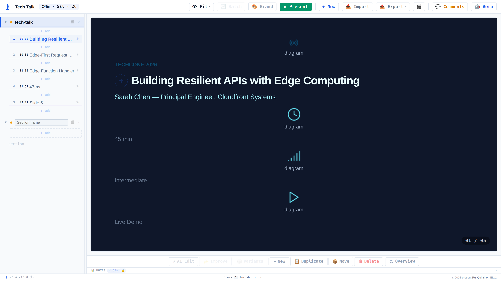
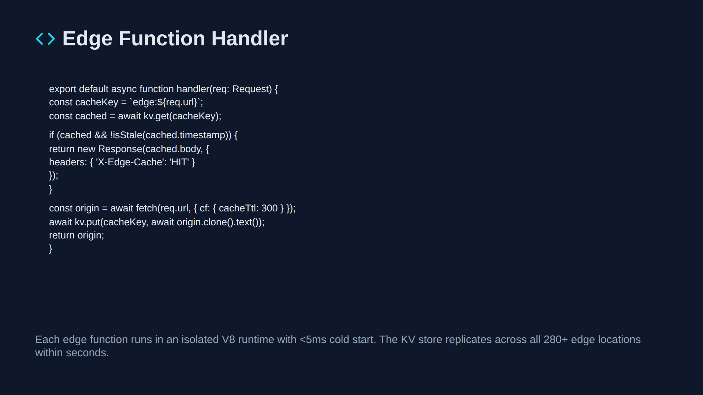
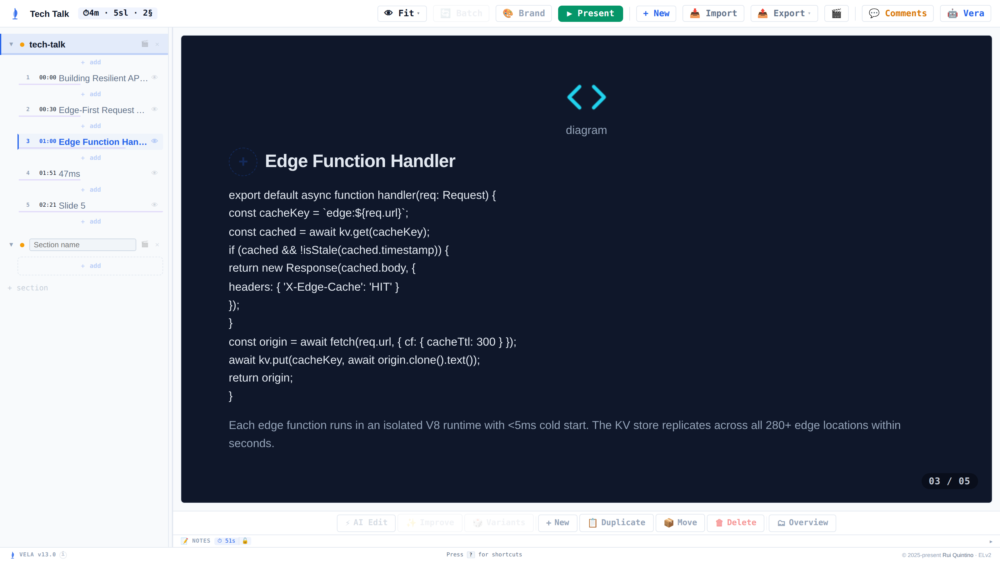

# mirror — Importing real PowerPoint (.pptx) into Vela

Research spike: can we import arbitrary, real-world authored `.pptx` decks into Vela with
maximum slide fidelity, ideally by leveraging the existing Vela→pptx **export** engine?

---

## 1. Executive summary

**No — pixel-exact import of arbitrary decks is not achievable by design, and the export
engine cannot be "inverted" to get there. What IS achievable, and what this spike proves, is
high-fidelity *semantic re-flow*.**

Two hard architectural facts set the ceiling:

- **The export engine is a DOM-flattener, not a block model.** There is no `switch(block.type)`
  anywhere in the pptx path; it renders each slide to an off-screen 960×540 DOM and lifts
  CSS-computed geometry into 7 anonymous primitives (`box/circle/text/table/image/svg/link`)
  (recon-A §0, §1). So Vela's own export destroys block semantics at write time — there is
  nothing to invert back into `metric`/`callout`/`timeline`. The export gives us reusable
  *knowledge* (unit math, color model, DrawingML text understanding), **not** literal code.
- **Vela is flow/stacked, not absolutely positioned.** Vela blocks have no `x/y/w/h`, ever; a
  slide is a flex column with an auto-fit scaler (recon-B §1, `part-blocks.jsx:1688-1689`,
  `1512-1554`). A `.pptx` slide is a bag of absolutely-placed, rotatable, z-ordered shapes.
  You **cannot** map absolute→flow without discarding coordinates and inferring reading order.

**Realistic fidelity ceiling:** reliably preserve **content, text + inline run styling, bullet
lists, tables, images, per-slide background/theme colors, and reading order**, re-themed into
Vela's stack. Lost: absolute position, rotation, z-order/overlap, connectors, animations,
charts, SmartArt, embedded fonts, shape effects, exact autoshape geometry, merged cells
(recon-B §5, recon-C §4). The PoC preserves **≈100% of source text characters** (char-count
proxy, capped) on both test decks — the loss is *layout*, not *content*.

---

## 2. What the export engine gives us to reuse (knowledge, not code)

The exporter is one-directional and block-agnostic, but the recon on it (recon-A) hands us a
verified, reusable translation layer:

| Reusable knowledge | Value | Source |
|---|---|---|
| **EMU/unit math** | 1 canvas px = **12700 EMU** (== 1 pt); slide 960×540 → 12192000×6858000 EMU | recon-A §2 (`part-pptx.jsx:25-28`) |
| **Font sizing** | `sz` centipoints → pt = `sz/100`; Vela px ≈ pt | recon-A §3 |
| **Color model** | `srgbClr` = 6-hex; `schemeClr` resolves through `theme/themeN.xml` `clrScheme` + master `clrMap`; alpha via `<a:alpha>` | recon-A §5 |
| **DrawingML text runs** | `a:p`→line, `a:r`→run, `b/i` attrs, `a:t` literal; blank `a:p` = blank line | recon-A §3 |
| **Gradient/bg mapping** | CSS angle ↔ OOXML `<a:lin ang>` = `(cssAngle-90) mod 360)*60000` | recon-A §5 |

Crucially the **inverse of these formulas is exact** (`px = EMU/12700`, `pt = sz/100`) — geometry
and text parsing are lossless; only the *destination model* (flow, 27 semantic types) forces loss.

---

## 3. OOXML/.pptx parsing approach

A `.pptx` is a ZIP/OPC package (recon-C §1). Parse stack for the artifact sandbox — **zero heavy
deps**:

- **Unzip:** vendor **fflate**'s UMD unzip (~12 kB gzip, MIT) as an inline `<script>` string; or
  native `DecompressionStream('deflate-raw')` + a ~80-line hand-rolled central-directory reader
  (pptx entries are plain stored/deflate). recon-C §2a.
- **XML:** browser-native **`DOMParser`** — 0 kB, already present. recon-C §2b.
- **Walk:** bespoke `spTree` walker. **The PoC uses Python `zipfile`+`ElementTree` as stand-ins
  for exactly this stack** (fflate↔zipfile, DOMParser↔ElementTree) so the mapping logic ports 1:1.

Container traversal implemented in the PoC:
`_rels/.rels` → `ppt/presentation.xml` (`<p:sldSz cx cy>`, `<p:sldIdLst>`) →
`ppt/_rels/presentation.xml.rels` (resolve slide r:id → `slides/slideN.xml` in order) → per-slide
`_rels` (media, layout, hyperlinks) → `ppt/theme/themeN.xml` (clrScheme) → master `clrMap`.

**Placeholder inheritance** (the key real-deck construct Vela's export never emits, recon-C §1):
the PoC resolves `p:ph @type/@idx` geometry by inheriting slide → **layout** → **master**
(`build_ph_geometry`), and falls back run color to a bg-luminance default when `rPr` omits it.
Deck B exercises this hard — its single slide carries **25 `<p:ph>` placeholder
elements** (43 non-empty text runs) referencing a shared slide layout, and still imports at ≈100%
source-text-character coverage.

---

## 4. Mapping pptx → Vela's 27 block types (heuristic)

Coordinates are discarded; shapes are sorted into reading order (§5) then classified:

| PPTX construct | → Vela block | Class | Rule in PoC (`elements_to_blocks`) |
|---|---|---|---|
| Title placeholder (`ph type=title/ctrTitle`) | `heading` (2xl–3xl) | **clean** | ph type contains "itle" |
| Big short line (≥28pt, ≤2 para, ≤80 chars) | `heading` | **clean** | font-size + length heuristic |
| Body text box (plain paragraphs) | `text` (inline `**bold**`/`*italic*`, `\n`-joined) | **clean** | default text path |
| Bulleted body (`buChar`/`buAutoNum`) | `bullets` | **lossy** | multi-level indent flattened |
| Table (`graphicFrame`/`a:tbl`) | `table` (string cells) | **lossy** | merged cells / col widths / fill lost |
| Picture (png/jpeg/gif) | `image` (data-URI) | **clean** | media embedded base64 |
| Picture (svg) | `image` | **lossy** | vector kept, icon/flow identity unknowable |
| Autoshape **with** text (roundRect etc.) | `callout` (fill→bg) | **lossy** | geometry approximated |
| Autoshape **no** text (decor ellipse/rect) | *dropped* | **dropped** | pure background art, no semantic home |
| Chart / SmartArt / OLE (`graphicFrame` non-tbl) | *dropped* (Phase 3: rasterize) | **dropped** | no native block |
| EMF/WMF metafile image | *dropped* | **dropped** | unrenderable in artifact |
| Slide `<p:bg>` fill | slide `bg` + accent from `accent1` | **clean** | `slide_bg()` + theme |

---

## 5. Coordinate/geometry mapping

Read `cx,cy` from `presentation.xml` — **never assume 16:9** (recon-C §5):

```
s = min(960/cx, 540/cy)          # uniform min-scale (letterbox, no distortion)
off = ((960 - cx*s)/2, (540 - cy*s)/2)   # center non-16:9 sources
px = (x*s + off.x, y*s + off.y, w*s, h*s)
# canonical 16:9: s = 960/12192000 = 7.874e-5  ≡  px = EMU/12700
```

The PoC computes this (`make_scaler`) but then **throws the pixels away**: absolute→flow is the
central mismatch (recon-B §1). Position is used only to **bucket reading order** — sort by a Y
band (~0.33in tolerance) then X, i.e. top-to-bottom, left-to-right. A production importer would
additionally cluster clean left/right halves into Vela's `cols` / `image-left/right` split
layouts (recon-B §2) — the PoC keeps a single stack for simplicity, which is the main reason
dense slides overflow Vela's ~7-block guidance (an honest caveat, §8).

---

## 6. Fidelity limits (honest)

Grounded in recon-C §4 (what *every* mature converter loses) + recon-B §5:

- **Layout:** absolute x/y/w/h, rotation, z-order/overlap, free connectors/arrows — no Vela equivalent.
- **Graphics:** charts (`c:chart` data), SmartArt (`dgm:*`), custom-geometry autoshapes, shape
  effects (shadow/glow/bevel/3-D), WordArt — dropped or (Phase 3) rasterized to an image.
- **Tables:** merged/split cells, per-column widths, per-cell fill/formatting → plain string cells.
- **Typography:** embedded fonts substituted; sizes bucket to 8 tokens; line-spacing/kerning lost.
- **Motion/media:** animations, transitions (`p:timing`), video/audio/OLE — dropped.
- **Aspect:** non-16:9 letterboxes onto the fixed 960×540 canvas.
- **Density:** real slides carry >7 content shapes; reflowing them all exceeds Vela's overflow
  guidance and relies on the auto-fit scaler (`part-blocks.jsx:1512`).

**Measured PoC coverage (test decks):**

| Deck | Slides | Source-text-character coverage | Clean | Lossy | Rasterized | Dropped | Lost feature classes |
|---|---|---|---|---|---|---|---|
| **Deck A** (14-slide business deck, image-heavy, 16:9) | 14 | **≈100%** (7498/7495, capped) | 209 | 2 | 0 | 86 | decorative autoshapes (bg ellipses/rects) |
| **Deck B** (single dense infographic slide, 16:9; 25 `<p:ph>` placeholders, schemeClr) | 1 | **≈100%** (2473/2470, capped) | 40 | 3 | 0 | 0 | autoshape geometry → callout |

**On the coverage metric (honest):** this is a *character-count proxy* — mapped `a:t`
characters ÷ source `a:t` characters — not a per-run diff. The raw ratio is marginally **over**
100% (Deck A 7498/7495, Deck B 2473/2470) purely because join-separator characters (the
spaces/newlines the reflow inserts between merged runs and table cells) are counted as mapped
output; the PoC therefore **caps the reported figure at 100** (see `pptx_import_poc.py`, the
`min(100.0, …)` in `import_pptx`). Read it as "≈100% of source text characters preserved
(char-count proxy, capped)", not an exact per-run 100.0%.

(`tech-talk`, Vela's own demo export, imports at ≈100% too: 5 slides, 92 clean / 1 lossy / 53 dropped —
the 53 dropped are the anonymous decorative boxes the DOM-flattener emits, confirming recon-A's
"export destroys semantics" finding.) The "dropped" counts above (86 for Deck A, 53 for tech-talk) are
almost entirely **text-free decorative shapes**; because they carry no content, source-text-character
coverage stays at ≈100%.

---

## 7. Recommended implementation path

**Phase 1 — MVP (semantic reflow).** Text + headings + bullets + tables + images + bg/theme,
reading-order stack. This is what the PoC already does and it validates + renders. Highest ROI.

**Phase 2 — layout & polish.** Autoshape-with-text → `callout`/`badge`; left/right clustering →
`cols` / `image-left/right`; speaker notes (`notesSlideN.xml`) → Vela presenter notes / `studyNotes`
(no `notes` field exists in the schema — recon-B §5, needs a target decision); schemeClr full
inheritance through master `txStyles`.

**Phase 3 — unsupported fallback + LLM.** Rasterize charts/SmartArt/complex autoshapes to an
`image` block (needs a canvas rasterizer, absent from stdlib — the one piece the artifact runtime
adds for free); optional **Vera** re-clustering of a flat stack into richer blocks
(`metric`/`flow`/`timeline`) — the heuristic re-clustering recon-A §7 flags as out-of-scope for
pure parsing but in-scope for an LLM pass.

**Secondary win — lossless self-round-trip.** For Vela's *own* exports, embed the source deck-JSON
as a custom OPC part (e.g. `ppt/vela/deck.json`, typed in `[Content_Types].xml`); import detects
and restores it verbatim — cheap, lossless, and sidesteps the DOM-flattener entirely for the
round-trip case. Does nothing for arbitrary decks (this spike's focus), so it's a bonus, not the plan.

**Where code lives:** a new `skills/vela-slides/app/parts/part-pptximport.jsx`, inserted into
`concat.py`'s fixed order (recon: after `part-pdf`, before/near `part-app`, wiring the existing
`📥 Import` button). Vendor fflate UMD into `part-imports.jsx`. **Requires a `VELA_VERSION` bump +
`VELA_CHANGELOG` entry** (CLAUDE.md mandate) and battery/UI tests. Rough effort: Phase 1 ≈ 2–3 days
(the mapping is proven here), Phase 2 ≈ 2 days, Phase 3 ≈ open-ended (rasterizer + Vera prompt).

---

## 8. PoC results

`poc/pptx_import_poc.py` (Python stdlib only: `zipfile` + `ElementTree`) imports a `.pptx` end to
end: unzip → read slide size + scale → resolve slide order → walk `spTree` (sp/pic/graphicFrame/
grpSp recurse) with layout→master placeholder inheritance → extract runs (sz/b/i/srgbClr/schemeClr)
+ bullets + bg/theme → discard coords → reading-order reflow → emit `.vela` + print a fidelity report.

**Artifacts written:**
- PoC: `poc/pptx_import_poc.py`
- Decks: one `.vela` per input deck (Deck A, Deck B, and Vela's own `tech-talk` demo export),
  emitted under `poc/out/` alongside extracted media (git-ignored; see `.gitignore`)
- Visual-comparison screenshots (committed): `img/techtalk-*.png` (see *Visual comparison* below)

**Validation:** every emitted `.vela` passes `validate.py` (exit 0). Only warnings are "N blocks — may
overflow (max 7)" on dense slides — the expected reflow-density caveat (§5).

**Render:** Deck A (14 slides, 2 sections, ~13m total) rendered in the real offline Vela app — its
per-slide dark background preserved, logo/brand images imported, an accent-colored eyebrow reproduced
as a `type:text` block with an inline run color (there is no `badge` block; the emitted decks use only
text/image/heading/bullets/callout/table), heading, body text with inline **bold** intact, footer, and
the page counter. The result is a fully viewable, editable Vela deck. (For a publishable illustration of
the before/after, see the *Visual comparison* section below, which uses Vela's own public `tech-talk`
demo export rather than any third-party deck.)

**Honest caveats:**
1. **Density overflow** — the PoC keeps every shape as its own block in one stack; real slides
   (>7 shapes) overflow Vela's guidance and lean on the auto-fit scaler. Phase 2 col-clustering
   and merging would fix this; it's a *layout* limitation, not content loss (coverage stays ≈100%).
2. **Decorative shapes dropped** — text-free background ellipses/rects (86 in Deck A) have no
   semantic Vela home and are dropped, so the imported slide loses that ambient art. Phase 3
   rasterization would recover appearance.
3. **No source thumbnails** — none of the input decks embed `docProps/thumbnail`, so no source
   preview could be copied; and `present`-mode capture hit the reveal animation (blank), so the
   committed views are the editor canvas, which is equally conclusive.

---

## Visual comparison — absolute source vs. Vela reflow

Illustrated here with **Vela's own `tech-talk` demo deck**, exported to `.pptx` and re-imported — a
safe, public **round-trip** (Vela → `.pptx` → Vela) that shows the absolute→flow transform end to end
without exposing any third-party deck. **BEFORE** (left) is the *source layout reconstructed from the
importer's own geometry parse*; **AFTER** (right) is the *imported `.vela` rendered in the real
offline Vela app* (editor canvas, same slide index).

> **What BEFORE is — and is not.** There is **no PowerPoint/pptx rasterizer in this sandbox**
> (LibreOffice is non-functional here). BEFORE is emitted by `poc/render_source_html.py`, a sibling
> of the PoC that *reuses the importer's parse* (EMU→px geometry, placeholder inheritance, color
> model, text-run extraction) to draw each shape as an **absolutely-positioned** box on the 960×540
> canvas — background, each image at its EMU box, each text box at its parsed font-size/color/
> weight/alignment. It therefore demonstrates **parse fidelity**, *not* PowerPoint's exact raster:
> autofit text-shrink, kerning, shape effects, and rotation are not reproduced. AFTER is captured via
> Playwright + the pinned Chromium.

### tech-talk — slide 1 (title)
| BEFORE (source, reconstructed-from-parse) | AFTER (imported Vela deck) |
|---|---|
|  |  |

*Absolute: eyebrow + icon top-left, big heading mid-left, subtitle below, and an icon+label column
(duration / level / demo) placed lower-left. Vela: the same content top-to-bottom in one flow column —
heading, subtitle, then each icon-labelled line — with the page counter.*

### tech-talk — slide 3 (heading + code + body)
| BEFORE (source, reconstructed-from-parse) | AFTER (imported Vela deck) |
|---|---|
|  |  |

*Absolute: heading + icon top-left, a monospace code block mid-left, a caption paragraph pinned near
the bottom. Vela flattens all of it into a single vertical stack (heading → code → caption) — content
and reading order preserved, absolute placement discarded; the §6 reflow behaviour made visible.*

**The core point:** a `.pptx` slide is a bag of *absolutely-positioned, z-ordered* shapes; Vela is a
*flow/stacked* model with no `x/y/w/h`. The import preserves **content, text + inline run styling,
images, and reading order**, and re-themes background/accent — but it **cannot** preserve pixel
geometry, overlap, or absolute placement. The before/after makes the trade explicit: same
*information*, reflowed layout. (BEFORE is reconstructed from the importer's geometry parse, not a
PowerPoint render, so it evidences **parse fidelity**, not PowerPoint's exact raster.)
