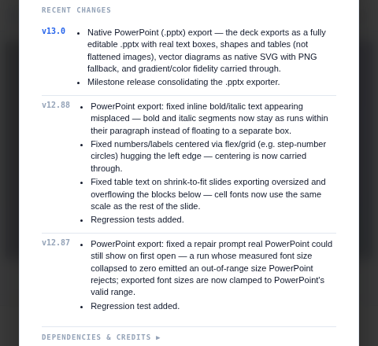
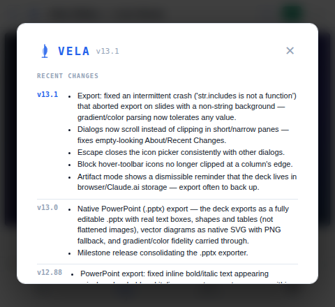
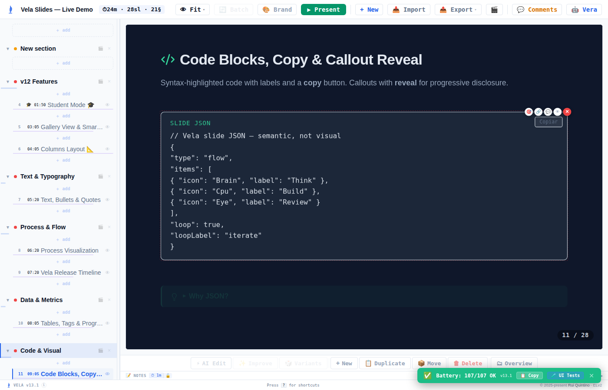
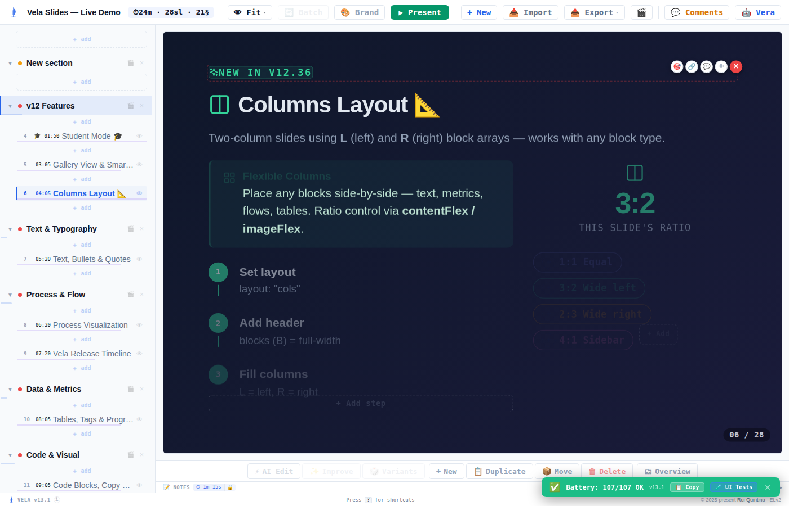
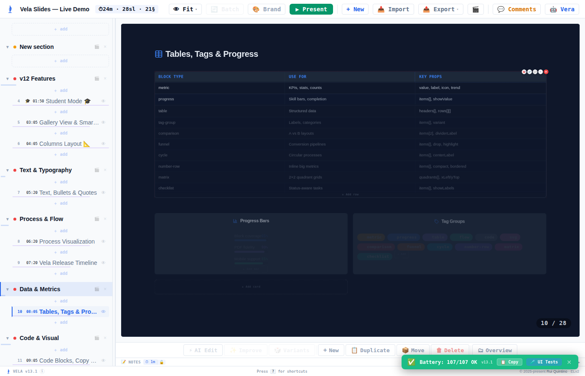
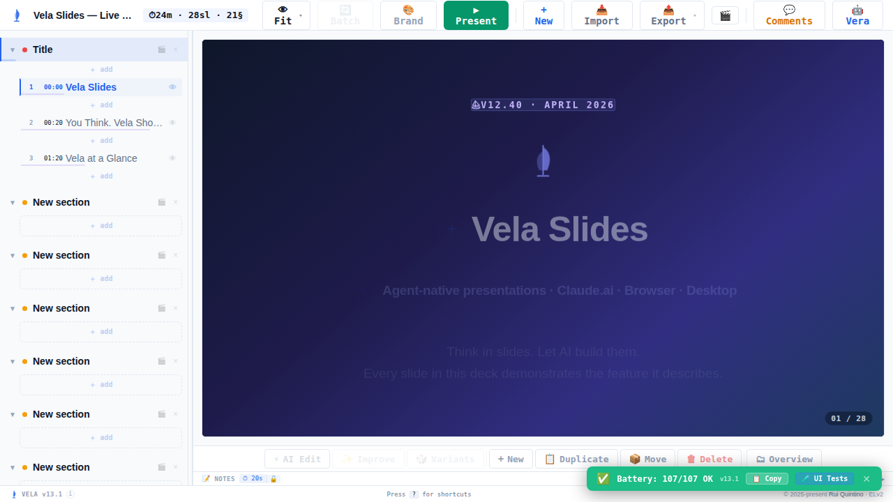
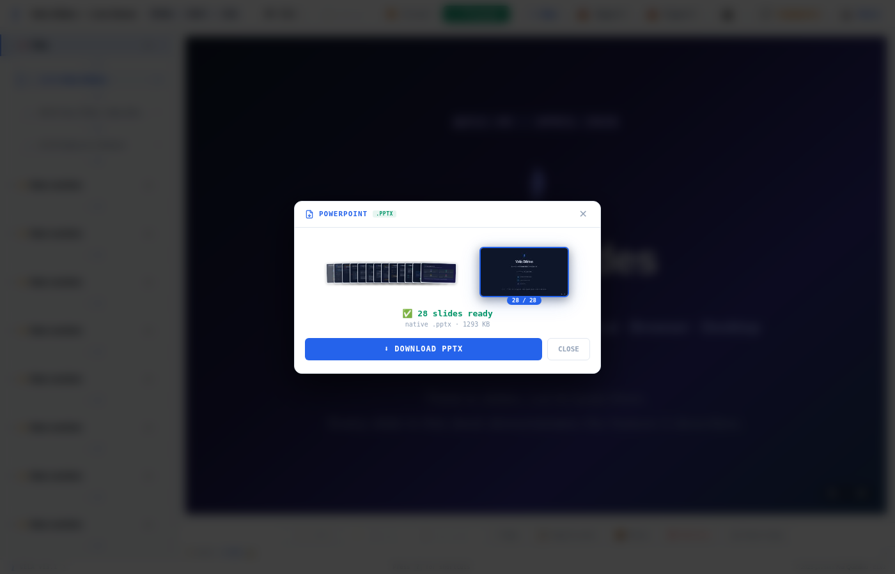

# Hyper-Sprint "lifeboat" — Export & UI reliability (v13.1)

**Date:** 2026-07-11 · **Branch:** `claude/export-ui-bugs-sprint-n58up8` · **Base:** `main` · **PR:** [#99](https://github.com/AgentiaPT/vela-slides/pull/99)

Batch of 5 user-reported bugs, delivered TDD (failing test first → fix → green) and gated on an independent **blind** browser validation.

---

## Scope (5 change requests)

| # | Report | Root cause | Fix |
|---|--------|-----------|-----|
| CR1 | Export fails intermittently — `str.includes is not a function` (slide N), claude.ai + neutralino | `parseLinearGradient(str)`'s `!str` guard let a **truthy non-string** background (number/object/bool/array) reach `.includes` | Guard gradient/color parsing (`parseLinearGradient`, `parseColor`, `domToCanvas` bg prefill) with `typeof === "string"` |
| CR2 | No warning that a claude.ai deck lives in local/browser storage | — (missing feature) | Dismissible artifact-mode banner: deck is in Claude.ai/browser storage → export/back up often |
| CR3 | Blank "Recent Changes" in the claude.ai artifact | `ModalBackdrop` card had **no `maxHeight`/`overflow`** → in the short artifact pane the centered dialog overflowed off-screen with no scroll | Add `maxHeight:"85vh"` + `overflowY:"auto"` to the shared modal card (fixes every dialog) |
| CR4 | Block tool icons cut at top-right (some block types) | Hover toolbar sits at `top:-10/right:-10`, **outside** the block; a **column-layout wrapper's `overflow:hidden`** cropped it at the column edge | Keep outer block/column wrappers `overflow:visible`; move scroll/crop to inner content div; column toolbar-padding buffer |
| CR5 | "Pick an icon" won't close on Escape | IconPicker's autofocus inputs called `e.stopPropagation()` on **every** keydown → Escape never reached the modal's window handler | Let Escape through (`if (e.key==="Escape"){onClose();return;}` before `stopPropagation`) |

All under `skills/vela-slides/`, so a single `VELA_VERSION` bump (13.0 → **13.1**) + changelog entry.

---

## Burndown (agentic)

```
work items   │
remaining    │
    5 ●───────────────┐  (5 CRs parsed)
    4        │        │
    3        │        └──● parallel workers land (part-pdf, part-app, part-blocks, part-icons)
    2        │           │
    1 blind gate round-1 │──● 2 blind validators (isolated warm servers)
    0 ────────────────────────●  clean gate: 0 in-scope defects, all features confirmed
        recon →  implement → integrate(359✓) → blind-verify → done
```

No fix-round bugs were introduced by the changes; the blind gate surfaced **0 in-scope defects** (one round). The only harness bump was a self-inflicted validation-harness collision (two validators sharing one browser page), fixed by giving each an isolated warm server — no app defect involved.

## Stats

- **Change requests:** 5 (5 fixed) · **Files touched:** 4 source part-files + `part-imports.jsx` (version) + regenerated `vela.jsx`
- **New regression tests:** 5 Node `.cjs` suites, one per CR, wired into `test_vela.py`
- **Test suite:** 354 → **359 passing** locally (`python3 tests/test_vela.py`); CI full suite green (Unit/Integration/Server/Desktop/Go/E2E/Template-sync)
- **Agents:** 4 implementation workers (sonnet) + 2 blind validators (opus, max-effort) + recon inline
- **Cost:** **$42.32** ($35.62 opus / $6.70 sonnet). Hub carried **0 images** (screenshots stayed in validator contexts; the hub read verdicts).

---

## Before / After

### CR3 — "Recent Changes" no longer blank (dialog scrolls instead of clipping)
At a constrained artifact-pane viewport (480×440):

| Before (base) | After (v13.1) |
|---|---|
| Card overflows the viewport: `top:-63, bottom:503` (vh 440), `overflowY:visible, maxHeight:none` — header + entries pushed off-screen = "blank". | Card fits: `top:0…33, bottom≤440`, inner scroller `overflowY:auto` (scrollHeight 616 / client 372 → 244px scrollable) — all 8 changelog entries reachable. |
|  |  |

*Blind validator A frame-check (after): "clean white card, header VELA v13.1, readable bullets including 'Export: fixed an intermittent crash…', 'Dialogs now scroll instead of clipping…'." PASS.*

### CR4 — Block hover-toolbar icons no longer clipped
After: full circular tool buttons (4 icons + red ×) on code, table, and column-edge blocks; rightmost button inside the clip box on all three.

| Code block | Columns layout | Table block |
|---|---|---|
|  |  |  |

*Blind validator B: rightmost-button vs clip-ancestor measured un-clipped on all three (`clippedRight:false, clippedTop:false`); frame-checked "5 full circles, complete and uncropped, including the rightmost red circle." PASS.*

### CR5 — Escape closes "Pick an icon"
After: clicking an editable icon opens the picker; Escape (focus in the autofocus search field) closes it.



*Verified: `pickerOpen:true` → Escape → `pickerAfterEsc:false`. PASS.*

### CR1 — Export runs without the `str.includes` crash
After: PowerPoint export of the 28-slide demo ran across every slide to completion (1.32 MB `.pptx`), no uncaught JS error.



*Unit: `parseLinearGradient` returns null (no throw) for `5, {}, true, ["a"], null, undefined, ""`; still parses real gradient strings (8/8). Blind validator B: export loop completed, `err:null`, no "is not a function". PASS.*

### CR2 — Artifact-mode backup reminder
Dismissible banner shown only in Claude.ai artifact mode (iframe: `window.self !== window.top`); correctly hidden in the top-level offline render. Source test asserts the `velaIsArtifactMode` gating, backup copy, and `data-testid`s. *(The in-iframe positive case is not drivable in the headless `file://` sandbox — verified by unit/source + logic; noted as a harness limitation, not a defect.)*

---

## Blind gate (stop rule)

Two fresh **opus, max-effort** validators, blind to the sprint history, driving a HEAD render through the burst-bug-hunter engine with an engine-enforced deadline, on **isolated** warm servers:

- **Validator A** (dialogs/storage): CR3 **PASS** (frame-checked). CR5/CR2 confirmed separately (CR5 by direct drive; CR2 hidden-at-top-level confirmed, artifact-iframe = harness limitation).
- **Validator B** (toolbar/export): CR4 **PASS** (frame-checked, measured). CR1 export **PASS** (28-slide PPTX, no crash).

**In-scope defects found: 0.**

### Post-integration fix-round (caught by CI, not the blind gate)
- **CR4 regressed native `.pptx` table export.** The worker had also changed the code/table blocks' own `overflow` (wrapping their content in an inner div) — defense-in-depth beyond the actual column-edge clip. But the toolbar is a DOM **sibling** of a block's own root, so those changes were unnecessary, and the table one made the grid rows *grandchildren* of the table root; `pptxExtractTables` reads the root's **direct** children → `tables=0`. The CI `pptx` e2e step caught it (`5 failed`), though the PR-comment "all passed" masked it (that comment's total excludes the `pptx` and `npm audit` steps — see below). **Fix:** reverted code/table to their original single-container roots (toolbar still un-clipped — confirmed in-browser), keeping only the column-wrapper fix. Added a regression guard in `test_block_toolbar_clip.cjs` for the extractor's direct-children contract. PPTX e2e back to **25/25**.
- **Blind-gate gap (lesson):** Validator B drove PPTX export and saw it *complete* (1.32 MB) without a JS error — but only checked "no crash", not "the table serialized as a **native** `<a:tbl>`". A no-crash export can still silently drop a table. The CI read-back assertion is what caught it; a future blind PPTX check should assert native-table presence, not just completion.

### Out-of-scope / pre-existing (not fixed here)
- During PPTX off-screen render, the console logs `Error: <path> attribute d: Expected number, "M 87.5% 4 L …"` — an SVG `<path d>` built with a **percentage** coordinate (invalid in path data). It does **not** crash the export and is unrelated to the overflow/parsing changes. Worth a follow-up (a divider/gridline SVG should use px, not `%`, in `d`).

### CI-status comment vs job status (worth knowing)
- The `ci.yml` "Test Suite" job runs `npm audit --audit-level=high` and the `pptx` e2e read-back **in addition to** the seven suites the PR-comment bot tallies. The bot's "✅ All checks passed — N/N" line is computed **only** from those seven suites' exit codes, so the job can be **red** while the comment reads green (as it did here for the table regression). When triaging, trust the **check-run/job conclusion**, not the comment total.

---

## What happened vs plan
- Plan held: 4 disjoint-file workers in parallel → clean integration, no merge conflicts, suite green between.
- One deviation: the **first** blind round was inconclusive due to a validation-harness bug (two validators sharing one warm browser page; one's iframe injection clobbered the other's DOM). Re-run on isolated servers → clean. Root-caused to orchestration, not the app.
- CR2's artifact-mode positive path isn't drivable in the headless `file://` sandbox — accepted as a documented harness limitation, covered by unit/source tests.
