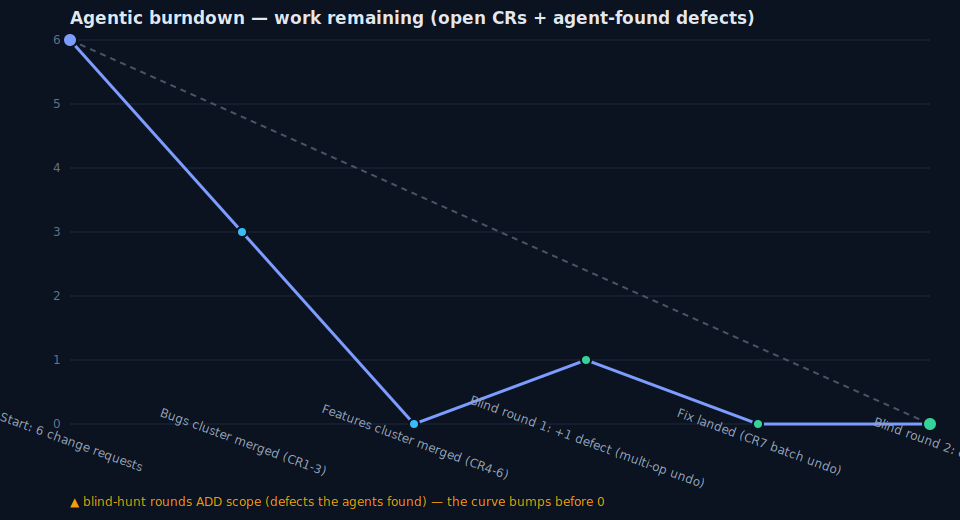
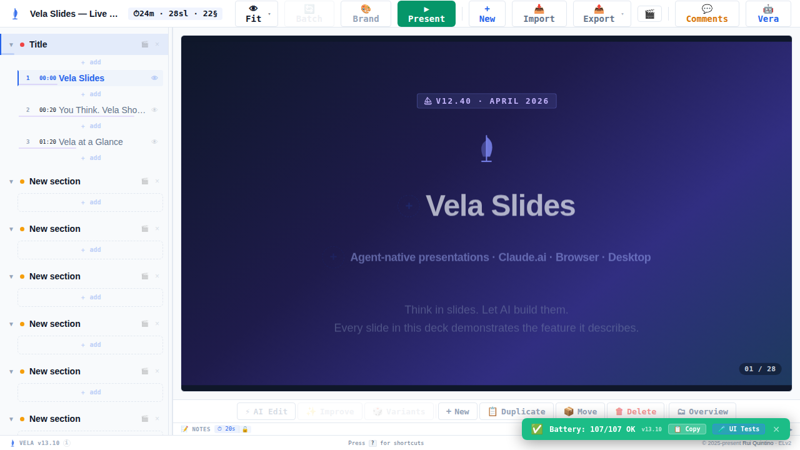
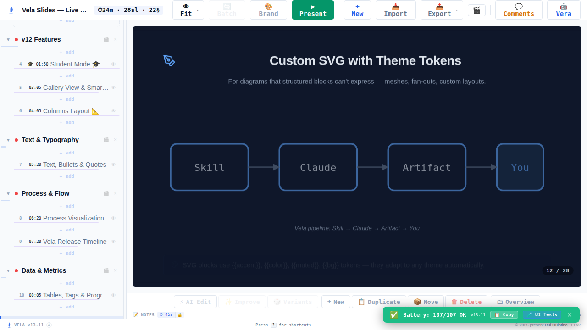
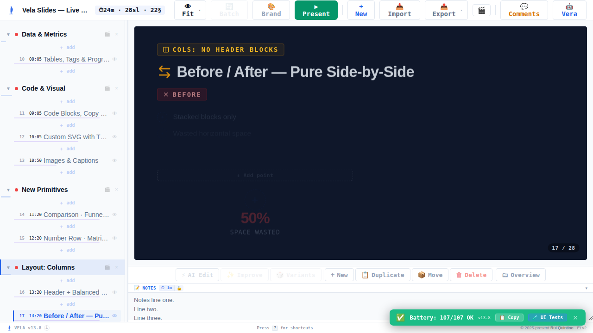
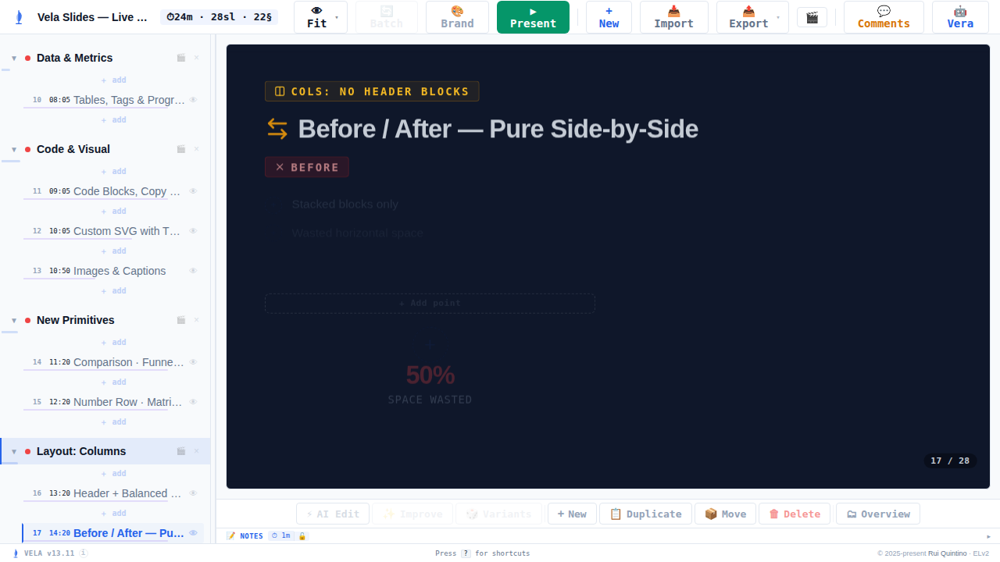
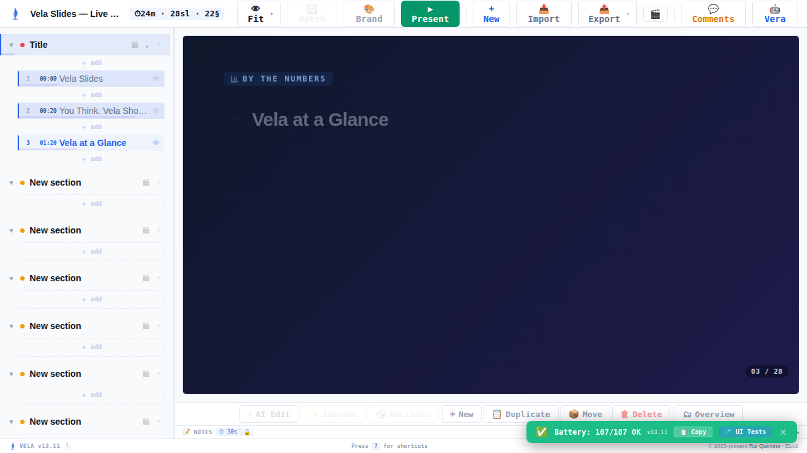
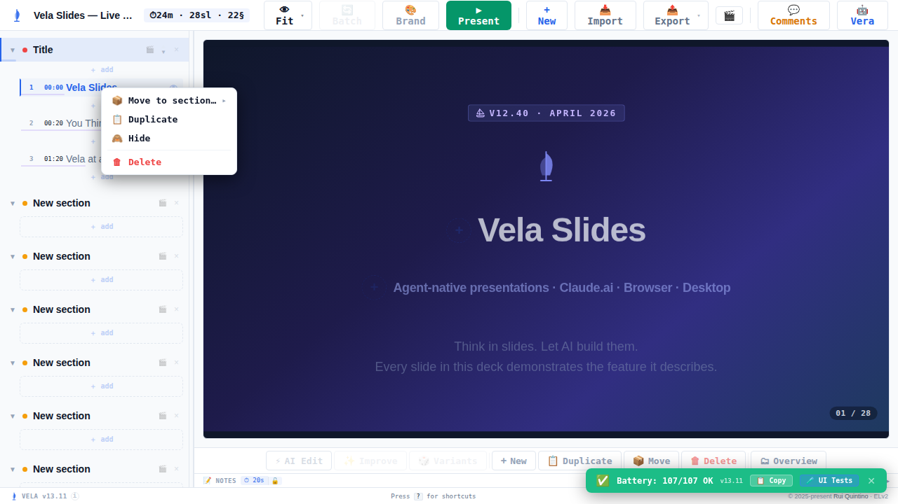
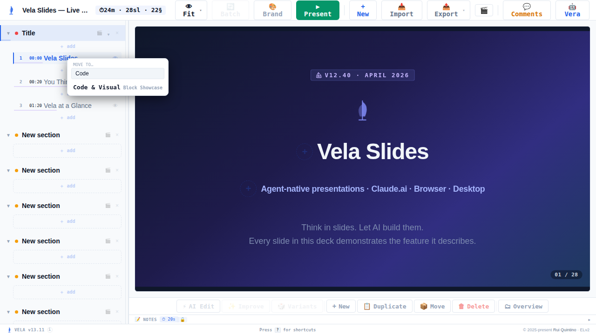

# Sprint "panorama" — Deck-Editor UX (multi-slide)

**Date:** 2026-07-13 · **Branch:** `claude/deck-editor-ux-multi-slide-eva5yj` (base `main`) · **Version:** 13.8 → **13.11**

Six deck-editor change requests (3 bugs + 2 features + 1 improvement), each bug reproduced as a failing test before the fix, then a blind adversarial gate that surfaced one more defect (multi-op undo) — fixed and re-verified clean.

---

## Scope

| # | Type | Change | Result |
|---|------|--------|--------|
| CR1 | bug | Opening a deck shows the **first slide**, not a blank editor | ✅ |
| CR2 | bug | **Centered text stays centered in the editor** (a left icon no longer left-aligns it) | ✅ |
| CR3 | bug | **Fixed 16:9 editor viewport**; the slide toolbar (AI Edit / Improve / …) no longer shifts between slides | ✅ |
| CR4 | feature | **Multi-select + copy slides** (shift/⌘-click, Ctrl/⌘+C → paste same or other deck, order preserved) | ✅ |
| CR5 | feature | **Right-click a slide in the TOC** → context menu (Move → section, Duplicate, Delete, Hide/Show) | ✅ |
| CR6 | improvement | **Move-slide section picker**: search box, wider scrollbar, mouse-wheel scrolls the list (not the deck) | ✅ |
| CR7 | bug (found by hunt) | **Multi-op single-step undo** — one gesture = one Ctrl+Z | ✅ |

---

## Agentic burndown

Work-remaining tracks open change requests. The blind hunt in round 1 *added* scope (the undo defect, CR7) before the curve reached zero — round 2 confirmed clean.

---

## Stats

- **3 source commits** on the sprint branch:
  - `652a0eb` — fix(editor): default to first slide, keep centered text centered, fix viewport/toolbar layout (CR1–CR3)
  - `b6bac17` — feat(editor): multi-select slide copy, TOC right-click menu, searchable move picker (CR4–CR6)
  - `9538de3` — fix(editor): multi-slide delete/paste/move undo as a single step (CR7)
- **Tests:** 361 → **396** Python tests + **195** UI-battery cases, all green. New coverage: reducer batch-ops suite, editor-UX source assertions, and DOM UI tests (alignment, fixed viewport/toolbar, multi-select, context menu, picker search).
- **Discipline:** every bug (CR1, CR2, CR3, CR7) was captured as a **failing test first**, then fixed, then confirmed passing.
- **Orchestration:** 2 recon agents → 2 sequential implementation workers (shared tree, disjoint clusters serialized on `part-slides.jsx`) → 1 fix worker → 2 blind gate rounds (best-model, no sprint history, driven through the burst-bug-hunter engine with an enforced deadline).

---

## Before / after

### CR1 — First slide on load
The reducer's `LOAD` auto-select was gated to presentation mode only (`VELA_PRESENTATION_MODE`), so the editor could open with `selectedId = null` (blank) — most visibly when switching decks, where the one-shot app-level fallback didn't re-arm. Reproduced as a failing reducer test; fixed by defaulting to the first module *with slides* in both modes.

| After (fixed, editor opens on slide 1) |
|---|
|  |

_(The base "before" — `img/cr1-before-blank.png` — does not reproduce visually in the single-load offline harness, because base has an app-level mount effect that masks the reducer gap there; the bug bit on deck switches. The fix closes the gap at the reducer level for all loads.)_

### CR2 — Centered text in the editor
Icon-heading blocks forced a flex row in the editor (`headingIconSlot = block.icon || textEditable`) and dropped `textAlign`, so centered headings rendered left. Fixed by carrying `textAlign: block.align` onto the inner text element.

| Before (left-aligned in editor) | After (centered, matches Present) |
|---|---|
|  |  |

Measured on slide 12 "Custom SVG with Theme Tokens": heading computed `textAlign` **left → center**.

### CR3 — Fixed viewport & stable toolbar
The editor slide viewport was elastic (absolute `inset:0`), and notes auto-expanded per slide (`notesOpen = showNotes || hasNotes`), shifting the toolbar. Fixed to a letterboxed 16:9 box; notes no longer auto-expand.

| Before (toolbar pushed up by notes) | After (toolbar stable) |
|---|---|
|  |  |

Measured toolbar `top` on a notes-bearing slide: **575 → 639**, now constant across light and heavy slides (639 = same as a light slide).

### CR4 — Multi-select + copy
Shift/⌘-click selects multiple slides; Ctrl/⌘+C writes a multi-slide clipboard envelope (`{_velaSlides,…}`, back-compatible with the old single-slide format); paste inserts them in order.

| After (rows 0–2 selected) |
|---|
|  |

Verified `data-selected = ["true","true","true", …]` (3 selected). Insertion order is unit-tested at the reducer level (`INSERT_SLIDES`).

### CR5 — TOC right-click context menu

| After (context menu: Move / Duplicate / Hide / Delete) |
|---|
|  |

Verified: Duplicate 28→29 (one undo restores), Move opens the section picker, Escape **and** outside-click both close.

### CR6 — Searchable move picker

| After (search filters sections; wide scrollbar; wheel scrolls list) |
|---|
|  |

Verified: `section-search` filters items (query "Code" → 1 match, no-match → 0); scroll container carries `.vela-wide-scroll` + `data-scroll-container`; a wheel over the list leaves the active slide index unchanged.

---

## Blind gate

Two rounds of independent, best-model verifiers with **no sprint history**, driven through the burst-bug-hunter engine with an engine-enforced deadline.

- **Round 1** — bugs surface: CR1/CR2/CR3 PASS. Cross-cutting hunter found **1 in-scope defect**: multi-select delete/paste/move each produced N undo entries (should be one). Features surface ran out of budget on app-model discovery (unconfirmed).
- **Fix** — batch reducer actions (`REMOVE_SLIDES` / `INSERT_SLIDES` / `MOVE_SLIDES_TO_MODULE`) → one history entry per gesture (`9538de3`).
- **Round 2** — features verifier: **CR4/CR5/CR6/CR7 all PASS** (multi-delete 28→25, one Ctrl+Z restores to 28); cross-cutting hunter: **zero in-scope defects**; first-slide/toolbar/viewport re-confirmed. **Clean.**

**Known environment limitation (not a defect):** the clipboard *read* round-trip is un-testable in the headless `file://` harness (`navigator.clipboard.readText()` hangs there). This is the same call the pre-existing single-slide paste used — not a regression — and the multi-paste insertion logic is covered by reducer unit tests.

---

## Cost

**$58.26** total across the orchestrator + 11 sub-agents (recon, implementation, fix, and blind verification). Hub hygiene held throughout — **0 screenshots pinned in the orchestrator context** (verifiers looked at proof frames and reported one-line verdicts; the hub read verdicts, not pixels). Full per-agent breakdown in `cost.json`.

---

## Files touched

`src/parts/part-reducer.jsx`, `part-blocks.jsx`, `part-slides.jsx`, `part-list.jsx`, `part-imports.jsx`, `part-app.jsx`, `part-uitest.jsx`; `tests/test_vela.py`, `tests/test_reducer.cjs`; `skills/vela-slides/SKILL.md`; regenerated `skills/vela-slides/app/vela.jsx`.
