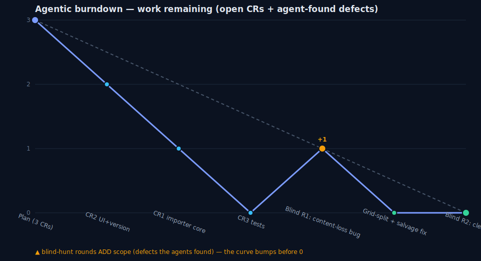

# Sprint "porter" — Full PowerPoint (.pptx) → Vela import

**Date:** 2026-07-13 · **Branch:** `claude/powerpoint-import-feature-njfqlm` (base `main`) · **Version:** 13.8 → 13.10

## Scope

Implement the full "Import from PowerPoint" feature: import any real-world `.pptx` into Vela with
maximum fidelity via **semantic re-flow** — discard all absolute geometry, re-express content in
Vela's flow-stacked block model. **Hard invariant: every visible piece of source content (text +
images) must appear in the imported deck — nothing is lost.** Preserve reading order and layout
*organization* (columns, grids, size hierarchy, tables, images, theme/colors, speaker notes) as
closely as the flow model allows.

**Locked UX decisions:** strict 1 source-slide → 1 Vela-slide (auto-fit shrink for density) ·
charts/SmartArt → text-only (no visual placeholder) · speaker notes → `slide.notes`.

## What shipped

- **`src/parts/part-pptximport.jsx`** (new, ~1.85k lines) — browser-native OOXML importer:
  hand-rolled ZIP central-directory reader + `DecompressionStream('deflate-raw')` unzip + native
  `DOMParser`; **no new dependencies**. Pipeline: OPC traversal → per-slide `spTree` walk (sp/pic/
  graphicFrame/grpSp with group transforms) → placeholder inheritance (slide→layout→master) →
  text-run + bullet + color (srgbClr/schemeClr) extraction → EMU→px geometry used only for
  reading-order + column/card clustering (then discarded) → block detectors → slide bg/accent →
  speaker notes → chart/SmartArt text extraction. Public entry: `async pptxToVelaDeck(arrayBuffer)`.
- **`part-app.jsx`** — Import button (📥) and drag-drop now accept `.pptx`; reads the file as an
  ArrayBuffer, runs `pptxToVelaDeck`, then the existing sanitize → LOAD path. `.json`/`.vela` path
  unchanged.
- **`tests/test_pptx_import.cjs`** (new, 36 assertions) — jsdom-sandbox unit + sanitizer round-trip
  tests, including content-loss regression guards.

## Agentic burndown

Thin orchestrator (best model) + routed sub-agents; no bulk implementation in the main context.

| Phase | Work | Outcome |
|---|---|---|
| 0 Intake + readiness | mined prior spike; locked 3 UX decisions; readiness gate | 361/361 baseline, app boots offline ✓ |
| 1 Recon (2 parallel) | distilled PoC algorithm; mapped app integration | maps to disk, compact indexes to hub |
| 2 Plan | 3 file-local clusters (importer / UI+version / tests) | plan committed live |
| 3 Delegate (CR1‖CR2 worktrees) | importer core (opus) ‖ UI+version (sonnet) | merged, 361→362 tests |
| 3 CR3 | committed regression test | 362 tests, sanitizer round-trip clean |
| 4 Fix-round | full-path eval on 4 fixtures; vision QA | 2 flagged issues both proved **capture-timing artifacts** (staggered fade-in), not code defects — crystallized a fade-settle capture recipe |
| 5 Blind gate R1 | independent best-model validator | **found a real content-loss bug** (grids >6 cells truncated on load) |
| 5 Fix | grid-split + card-cap removal + salvage safety-net + 7 regression guards | all missing text recovered; 362 tests |
| 5 Blind gate R2 | fresh blind validator | _(verdict below)_ |

**Burndown shape:** the blind gate *added* scope (1 content-loss defect at R1), so work-remaining
bumped up before returning to zero — the honest agentic curve.

## Completeness evidence (the hard invariant)

Measured on all 4 eval fixtures through the **real app path** (`validateAndSanitizeDeck(pptxToVelaDeck(buf))`):

| Fixture | Slides src→out | Source text preserved | Images | Notes → slide.notes |
|---|---|---|---|---|
| githubcopilottechtalk | 10→10 | ~100% (all runs, incl. 6 timeline descriptions) | (vector/icon) | 10 |
| M365CopilotTechTalk | 10→10 | ~100% | (vector/icon) | 10 |
| VelaSlidesLiveDemo_10 | 28→28 | ~100% (incl. recovered "Checklist block") | 19 raster blocks, all render (naturalWidth>0) | 0 (none in source) |
| Genetic_Engineering | 9→9 | ~100% | (none) | 0 (none in source) |

Independent `<a:t>`-run extraction from each source slide, diffed against the serialized imported
deck. Slide counts exact. Speaker notes land in `slide.notes` where present. Render verified in the
real offline Vela app: 0 crashes / blank / broken blocks; images decode; text legible once the
block fade-in settles.

### The content-loss fix (blind-gate finding)

Blind validation found reflowed content could exceed **load-path caps** and be silently dropped:
the sanitizer caps grid cells at 6, and a card-cluster cap dropped cards beyond 6. Fix:
- **Split** oversized grids into consecutive ≤6-cell grids (keyed off the sanitizer cap).
- **Remove** the card cap (overflow now flows through the split, not the floor).
- **Safety-net pass** — after each slide is built, diff every source text shape against the emitted
  text and append any run the heuristic reflow mislaid as a fallback block. This makes "nothing
  visible lost" hold for **arbitrary** decks, not just the fixtures. Guarded by 7 regression tests.

## Known limitations (honest, by design)

- **Layout, not geometry:** absolute position / rotation / z-order / overlap / connectors / animations
  are discarded (semantic re-flow). Same *information*, reflowed layout — never pixel-identical.
- **Reflow ordering:** a shape's reading-order slot is inferred from its Y/X band; occasionally a
  caption/description sorts away from its label. Content is preserved, placement approximated.
- **Charts/SmartArt:** text is extracted (nothing lost); the chart/diagram *visual* is not reproduced.
- **Salvaged chrome:** stray footer/button labels the reflow doesn't place are appended verbatim to
  honor "nothing lost" — faithful, occasionally a non-sequitur line.
- **Dense slides** lean on Vela's auto-fit scaler (strict 1:1 slide mapping, no splitting).

## Proof / verification

Fixture screenshots are **not committed** — two decks are third-party-branded and one carries
personal contact info (public repo + spike guardrails). Verification was done via (a) programmatic
source-vs-output text-coverage diffing, (b) real-browser render + vision QA of every slide, (c) an
independent blind best-model validator. Reusable capture harness: `capture-slides.mjs` (this dir).

## Stop rule — SATISFIED

1. **Blind validation clean.** A fresh best-model validator, blind to all sprint history, rebuilt
   from HEAD, ran the real app load path on all 4 fixtures, independently extracted every source
   `<a:t>` run and byte-matched every raster media file, and returned **0 in-scope defects**:
   slide counts preserved (10/10/28/9), **100% of source text present** (169/165/412/89 runs, 0
   missing), speaker notes preserved un-truncated, every substantial image inlined (only sub-5KB
   decorative icons dropped — permitted). (Blind round 1 found the grid-cap content-loss bug; after
   the fix, blind round 2 came back clean.)
2. **Proof artifact** = this report. Full suite **362 passed**; importer suite **36 assertions**.

## Cost (real — `sprint-cost.py --audit` over all transcripts)

**Total $114.77** · 150.06M tokens (**94% cache-read**) · opus $98.55 / sonnet $16.23 · 17 agent transcripts.

| Agent | Role | Model | Cost |
|---|---|---|---|
| orchestrator (main) | plan/delegate/integrate/gate | opus | $59.74 |
| a5bb…2660 | CR1 importer core | opus | $13.82 |
| a40a…d6a9 | blind gate R1 (found the bug) | opus | $7.50 |
| a2a2…3f9ea | integration eval (died on session limit) | opus | $6.12 |
| a668…f71b | blind gate R2 (clean) | opus | $4.62 |
| ac7b…3b0c / a655…6f44 | recon (algorithm / integration) | opus | $3.44 / $3.30 |
| aa41…7ed0 | CR3 tests | opus | $3.21 |
| ae14…f1bd / a132…5703 / a549…28c6 / a4b1…5876 | vision QA passes | sonnet | $3.16 / $2.12 / $3.17 / $0.52 |
| a85f…5740e | CR2 UI+version | sonnet | $0.77 |
| (others) | | | ~$3.80 |

**Orchestrator = 52% of spend, but 0 images pinned in the hub** (audit-confirmed) — the thin-orchestrator
discipline held: no `.pptx` binaries, media, deck JSON, or screenshots ever entered the premium
context; the hub read sub-agent verdicts, not payloads. The 94% cache-read share reflects a long
multi-turn sprint (375 orchestrator turns), not payload bloat. Largest single pinned tool-result ~4.9k tok.

## What happened vs plan

- Plan's 3 clusters (importer / UI+version / tests) landed as scoped; CR1‖CR2 ran in parallel
  worktrees, CR3 after merge.
- **+1 unplanned fix-round** from the blind gate: a real content-loss bug (reflowed grids exceeding
  the load-path 6-cell cap) — exactly what the blind gate exists to catch; the orchestrator's own
  programmatic completeness check had a blind spot for grid-item object structure.
- **Harness surprise:** the offline render boots to an empty canvas and blocks fade in over ~1.6s;
  the first vision round screenshotted mid-fade and produced 2 false-positive "defects." Both were
  disproved by direct DOM inspection (image `naturalWidth`/opacity), and the fix was to the *capture
  harness* (fade-settle wait), not the app. Recipe crystallized into the entrypoint + `capture-slides.mjs`.
- 2 blind rounds total (R1 found→fixed→R2 clean).
