# Sprint "clarity" — UX-clarification hyper-sprint

**Date:** 2026-07-23 · **Branch:** `claude/sprint-ux-clarification-m7ot9d` · **Base:** `main` (`f79518f`, v13.19) → **Final HEAD:** `8076c3f` (v13.20)
**Result:** 5 change requests delivered · 10 agent-found defects fixed · blind gate clean (round 3, 0 in-scope defects) · 421 tests pass.

> Plan & verbatim original prompt: [`plan-2026-07-23-clarity.md`](./plan-2026-07-23-clarity.md)

---

## Scope

Five change requests from a user issue list. The novel twist this sprint: **not every CR had a settled
final UX.** The orchestrator triaged the list up front — the two clearly-specified items went straight to
implementation; the three ambiguous ones went through a **PO/PM/UX discovery** step first (explore the live
app + code, propose the final UX per modern practice, keep everything consistent), and the one "why is this
even happening" item went through a **root-cause investigation**. See the process note at the bottom.

| CR | Area | Clarity | Summary |
|----|------|---------|---------|
| **CR1** | Gallery / overview | Clear (bug) | Section title-card slides now render in gallery/overview as they'll be presented |
| **CR2** | TOC edit mode | Ambiguous → discovery | Arrow-key collapse/expand of TOC sections + never-lose-your-slide marker |
| **CR3** | Desktop (Neutralino) | Root-cause unknown | Robust file save + a visible save-status pill (no more silent stops) |
| **CR4** | Image paste | Ambiguous → discovery | Count-driven balanced image grid (1→5), text stays first-class |
| **CR5** | AI / Vera | Ambiguous → discovery | One consistent "AI working" animation across *every* AI operation |

---

## Agentic burndown

Work remaining = open CRs + agent-found defects. Implementation drives it to zero; then each **blind**
validation round *adds* scope (defects the independent validators found) before the fixes drive it back down.
The curve bumps **up** at round 1 (+8) and round 2 (+2) — that is the blind gate doing its job.

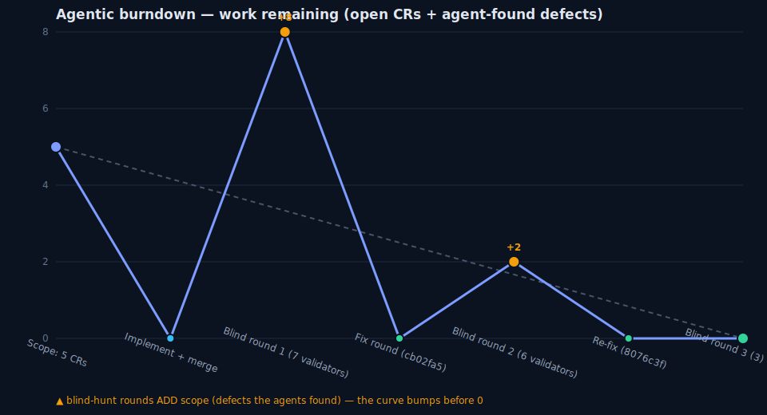

| Phase | Work remaining | Note |
|-------|----------------|------|
| Scope | 5 | 5 CRs |
| Implement + merge | 0 | 4 parallel workers → integrator merge |
| **Blind round 1** (7 validators) | **8** | +8 in-scope defects found |
| Fix round (`cb02fa5`) | 0 | all 8 fixed + regression tests |
| **Blind round 2** (6 validators) | **2** | +2 regressions found |
| Re-fix (`8076c3f`) | 0 | both fixed + regression tests |
| **Blind round 3** (3 validators) | **0** | clean — 0 in-scope defects |

---

## Stats

| | |
|---|---|
| Version | v13.19 → **v13.20** |
| Commits (base→head) | 16 (4 worker branches, 3 integration merges, 2 fix rounds, changelog dedup) |
| Tests | `test_vela.py` **421 passed** |
| UI battery | **229** (220 pass / 0 fail / 9 AI-skip) — deterministic across 3 reloads |
| Build | `concat.py` in sync (parts ↔ `vela.jsx`) |
| Defects found & fixed | **10** (8 in round 1, 2 in round 2), 0 remaining |
| Sub-agents | 27 · **~130 min** wall-clock |

---

## Before / after — per change request

### CR1 — Gallery renders section title cards

**Was:** clearly a bug. Gallery/overview omitted section title-card slides even when a section had its title
card enabled, so the overview didn't match what would actually be presented.
**UX decision:** render each enabled section title-card slide in gallery/overview exactly as presented —
distinct 🎬 styling, **non-draggable**, and **excluded from all slide counts** (including the thumbnail
page-badge total, so numbering still reflects real content slides).

Sections with title cards enabled now show their card as a rendered tile (here every section is toggled on):

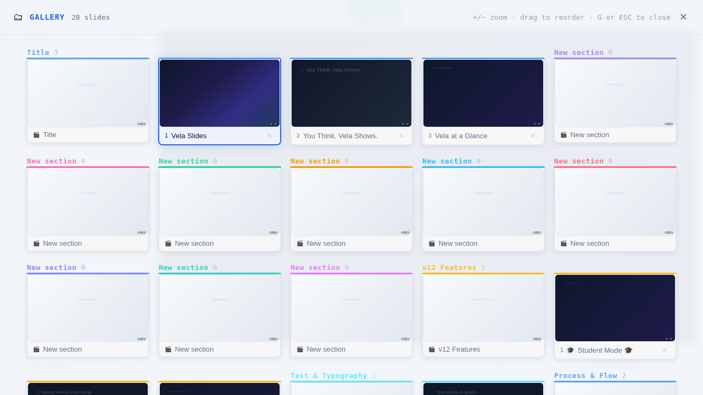

---

### CR2 — TOC collapse/expand on the arrow keys

**Was ambiguous** — the user knew the pain but not the fix: arrow keys navigate slides even *into* a collapsed
section, whose rows are unmounted, so the current-slide highlight vanishes and you lose your place.
**UX decision (discovery):** make the edit-mode TOC a proper **ARIA tree**. On a focused section header,
**Right = expand / Left = collapse**; on the canvas, Left/Right still advance slides. A collapsed section that
holds the current slide shows a **live `k/N` marker + accent border** (no auto-expand), so you always know where
you are. Collapse state **survives undo/redo**.

Collapsed "Title" section keeps a live `1 / 3` marker (never loses the current slide):

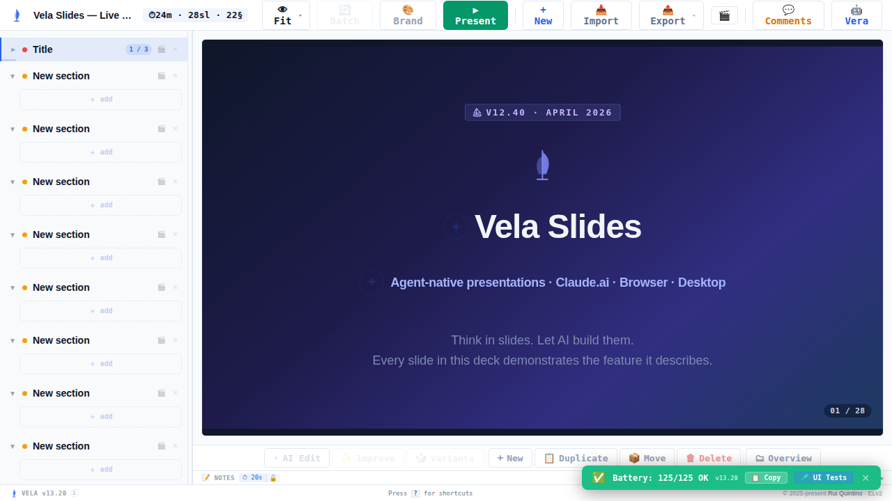

Collapse/expand state persists across undo:

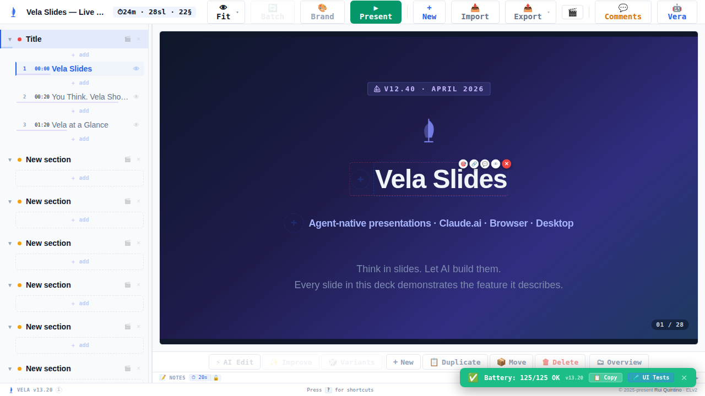

---

### CR3 — Desktop save reliability + status pill

**Root-cause investigation** (Windows/Neutralino only, not reproducible in the Linux harness). The desktop
save path was fire-and-forget with **no feedback channel** — failures were invisible. Fix is high-level:
robust save (retry/verify, keep-unsaved-on-failure, a content-hash watcher echo-guard, and a reconnect probe)
plus a **save-status pill** and a one-shot failure toast, so a save can never stop silently again. Windows-only
triggers are documented for manual confirmation.

Pill state cycle — **Saving**, **Saved**, **Couldn't save — Retry** (+ toast), **Reconnecting** (+ toast):

| Saving | Saved |
|---|---|
| 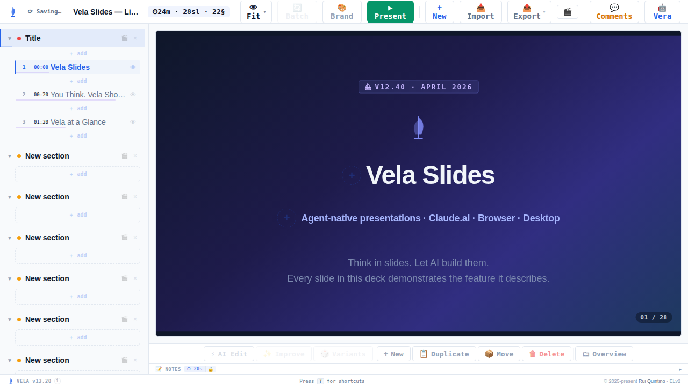 |  |
| **Couldn't save — Retry** | **Reconnecting** |
| 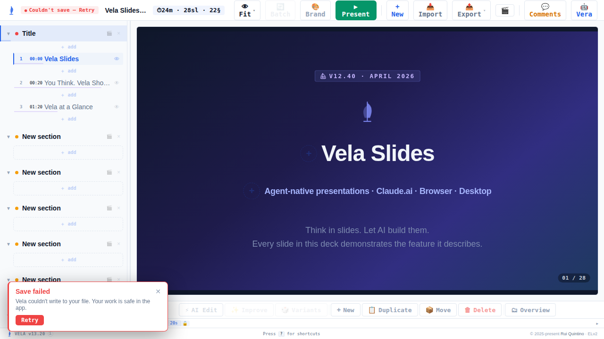 |  |

_Before: the pill and failure toast did not exist — a stalled save produced no UI at all._

---

### CR4 — Balanced multi-image paste layout

**Was ambiguous** — the heuristic was undefined. Old behavior: a 2nd image pasted onto an image-only slide
was **appended into a single vertical column** — images shrank with big empty gutters on either side.
**UX decision (discovery):** a **count-driven balanced grid** — 1 solo, 2 side-by-side, 3 thirds, 4 = 2×2,
5 = 3+2 centered. Images share the canvas with text (text stays first-class), the run **caps at 5** (a 6th
spills to a new slide), grids stay on-canvas, and tall images **letterbox** into uniform cells.

**Before — single-column stack (v13.19):** two images stacked, awkward dead space either side.

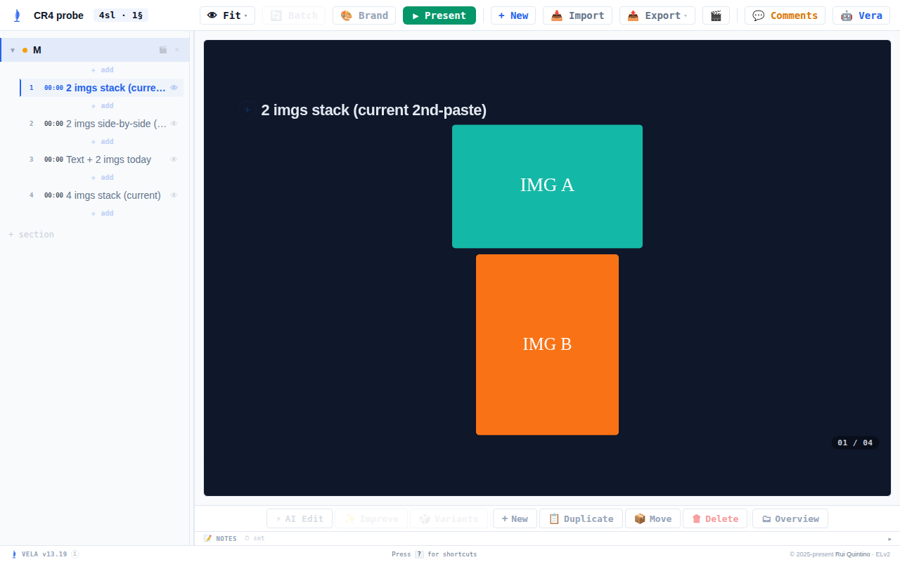

**After:**

| 2 → side by side | 4 → 2×2 quad |
|---|---|
| 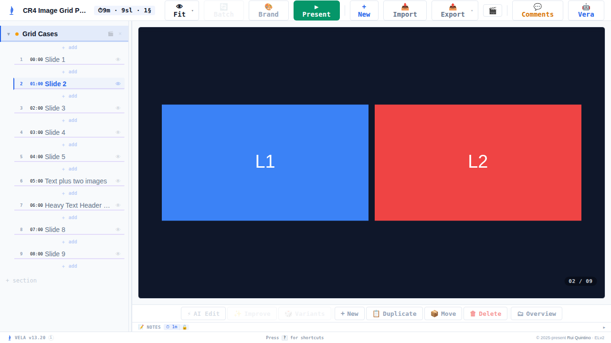 | 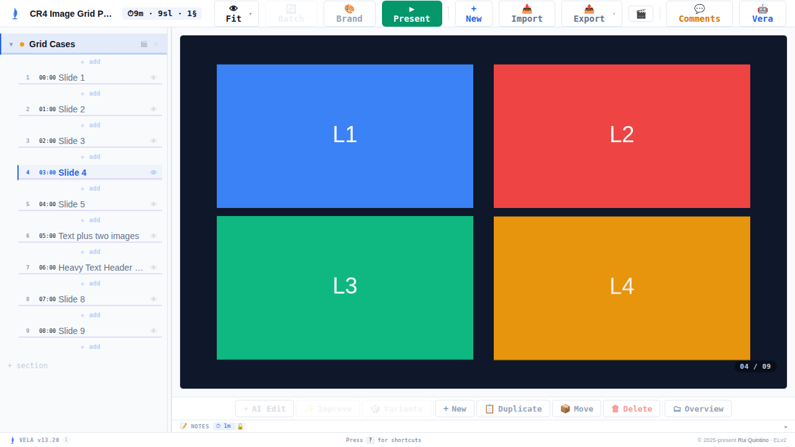 |
| **5 → 3 + 2 centered** | **Portrait letterboxes into its cell** |
| 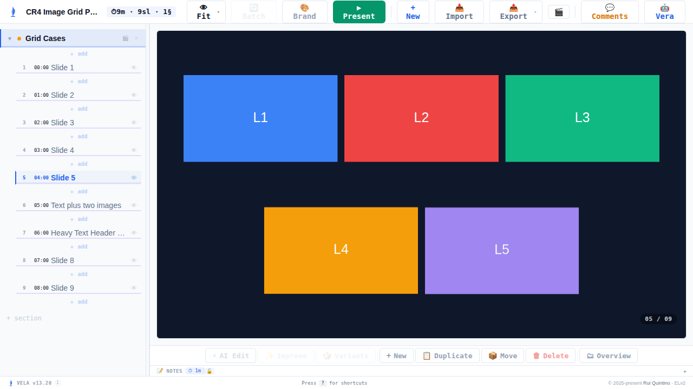 | 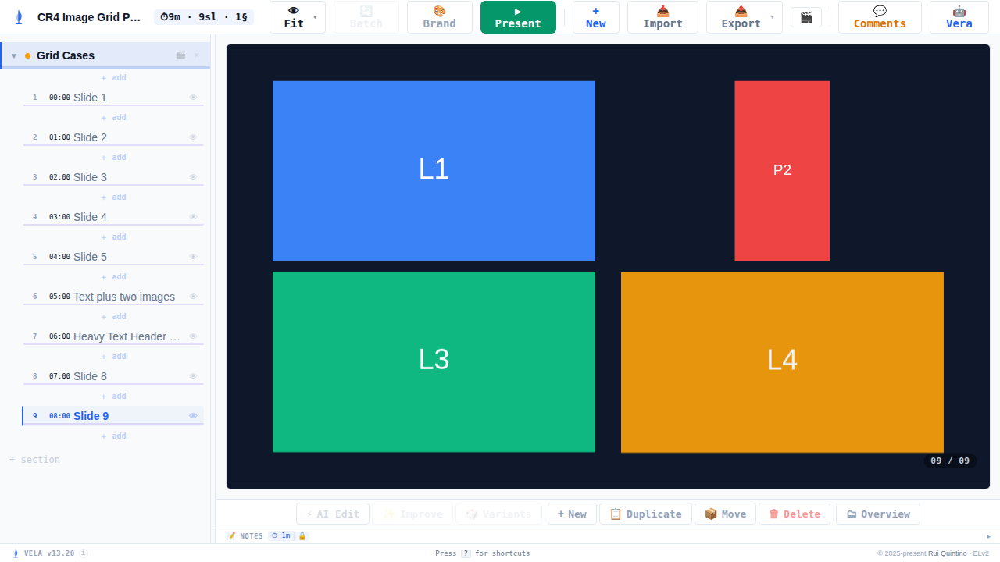 |

---

### CR5 — Consistent AI-working animation

**Was partly ambiguous** — an animation existed for *some* AI operations but not others (notably chat / Vera
edits animated nothing), and the treatment/trigger were undefined.
**UX decision (discovery):** a single **`aiWork` flag** drives one consistent overlay on **every** AI operation
— the `vera-thinking` scan while working, then a `magic-reveal` settle — accent-tinted, and **reduced-motion
honored**.

Mid-reveal (`magic-reveal` settle as the AI-edited slide comes back in):

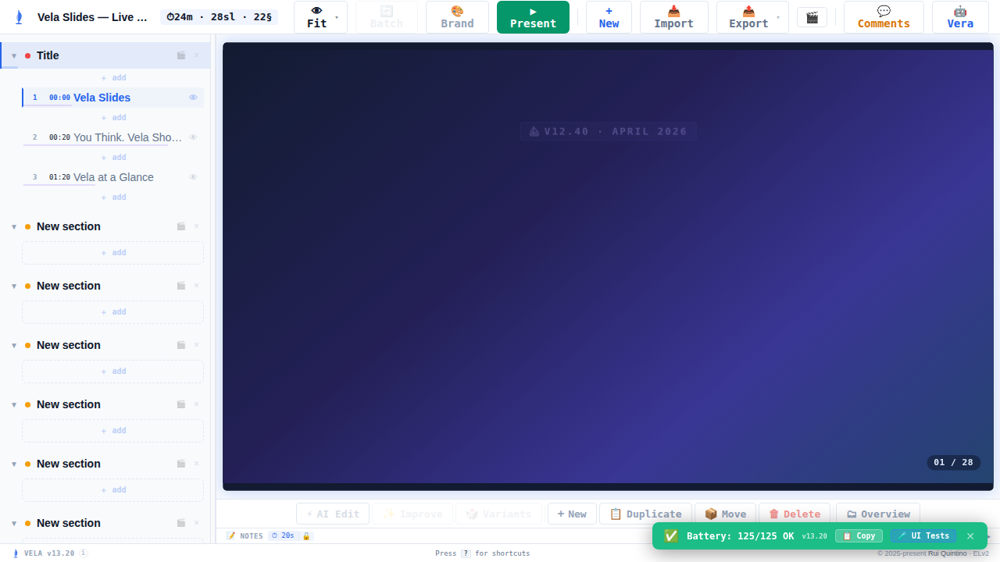

After switching modules the animation settles cleanly — no stuck shimmer on the wrong slide (round-2 regression fix):

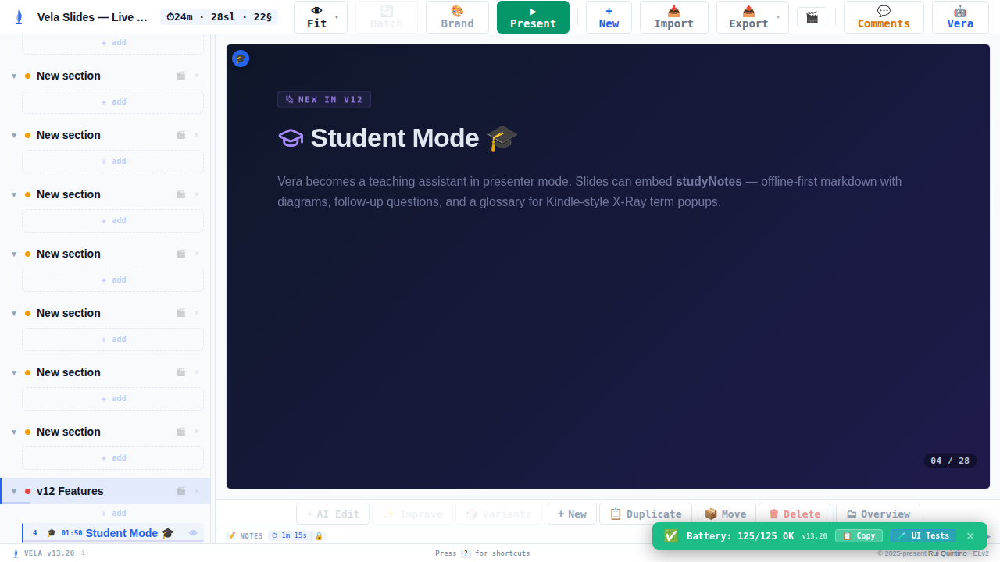

_Before: chat / Vera edits showed no working animation at all._

---

## Defects found & fixed (all agent-found, all fixed)

Every defect below was surfaced by an **independent blind validator**, not the implementer — then fixed with a
regression test.

**Round 1 — 8 defects → fixed in `cb02fa5`:**
1. CR1 — title cards mis-counted in the thumbnail page-badge total.
2. CR2 — collapse state not preserved through undo/redo.
3. CR2 — flaky TOC tests.
4. CR3 — watcher echo-guard gap.
5. CR3 — failure toast not re-arming after dismissal.
6. CR4 — grid overflow off the canvas at high image counts.
7. CR5 — settle animation fired on the wrong slide.
8. CR5 — `aiWork` flag could stick, leaving a shimmer running.

**Round 2 — 2 regressions → fixed in `8076c3f`:**
1. CR4-D2b — grid images collapsed to height 0 / invisible.
2. CR5-D7b — cross-module wrong-slide settle.

**Round 3 — 0 in-scope defects (clean).**

---

## Cost / savings

| | |
|---|---|
| Total sprint cost | **$161.49** (Opus-dominant; sonnet $0.66) |
| Orchestrator hub | **$40.30 (25%)** — healthy thin-hub ratio; 0 images pinned in hub |
| Sub-agents | 27 |
| Wall-clock | ~130 min |

The hub stayed a thin planner/delegator/merger — 25% of spend, with all diagnosis, browser-driving, capture,
and fix-verification pushed to sub-agents. Ten defects were caught and fixed **before** the sprint closed, by
agents that never saw the implementation — the cost of that quality gate is the difference between shipping a
UX change and shipping one that actually works across undo, module switches, and every image count.

---

## Process improvement — discovery for ambiguous CRs

This sprint's deliberate improvement over the base skill: **ambiguous change requests were not implemented
blind.** CRs 2, 4, and 5 each got a mixed **PO/PM/UX discovery** agent that explored the live app *and* the
code, studied current behavior, and proposed the **final** UX per modern deck/gallery practice while keeping
the app internally consistent — written to a UX spec before any code was touched. CR3 (a "confirm and find the
root cause" item) got a source-level **root-cause investigation** that also recommended the failure-surfacing
UX. The two clearly-specified items (CR1, and the mechanical half of CR2) went straight to implementation.

The result: the delivered UX for every ambiguous item is a deliberate design decision with a written rationale,
not a guess — and the blind gate then proved each one holds up under adversarial use.

## How it was made

4 parallel worktree workers (CR1+CR2, CR4, CR5, CR3) → integrator merge (which also brought the branch up to
date with main's security work) → changelog dedup → two blind-gate/fix rounds → clean round 3. Screenshots in
`img/` are the blind validators' own proof shots (rounds 2–3, on v13.20); the CR4 "before" is from the base
commit v13.19. Desktop-save and security details are kept high-level by policy.
