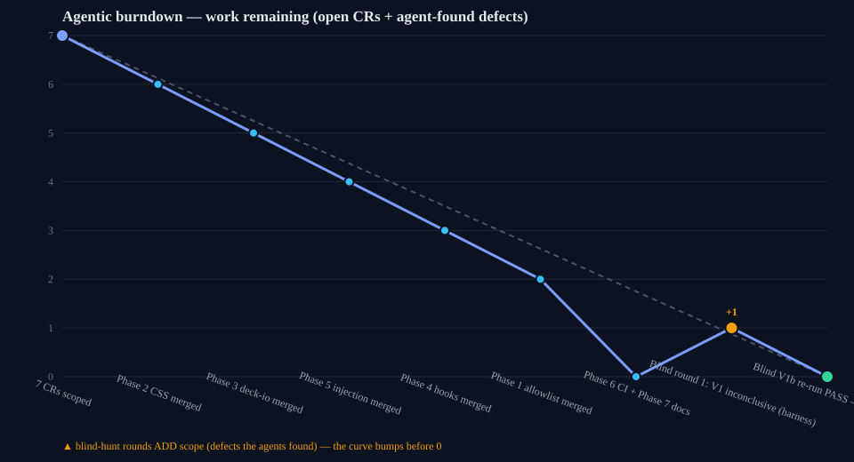
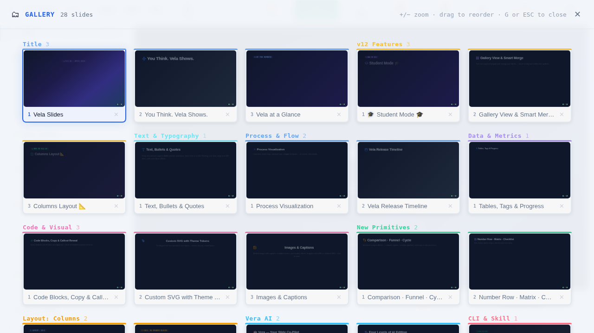
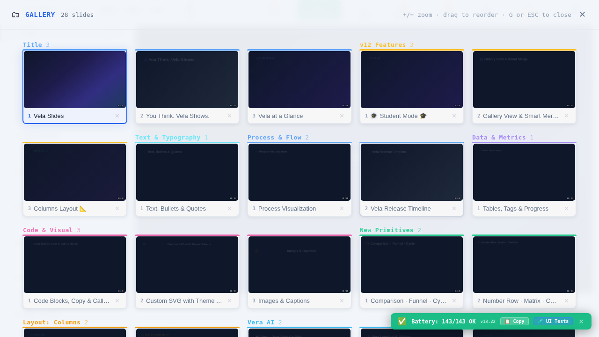
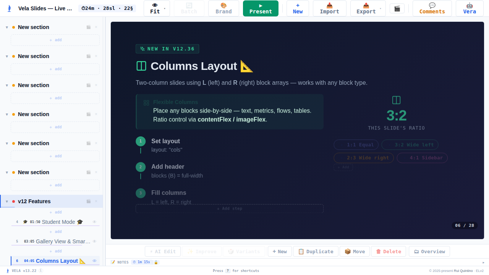
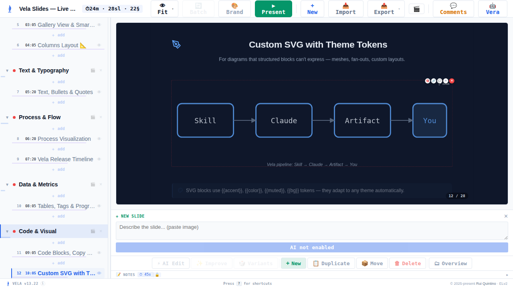
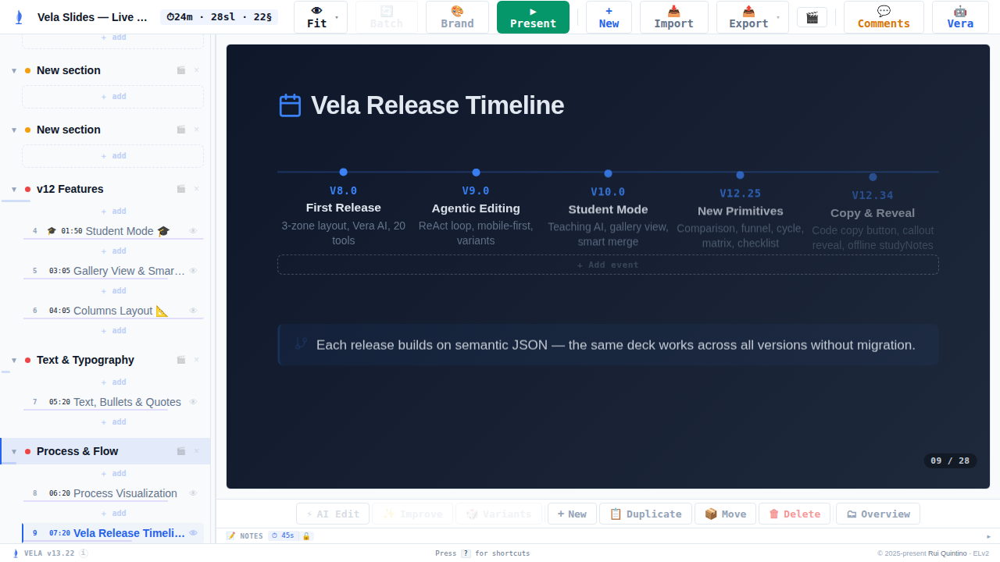
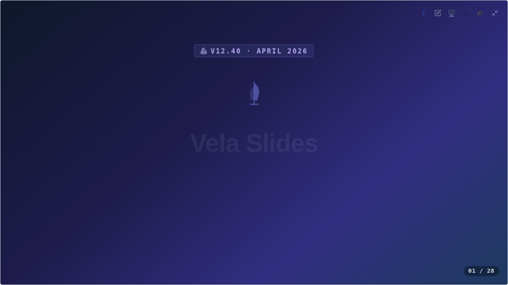
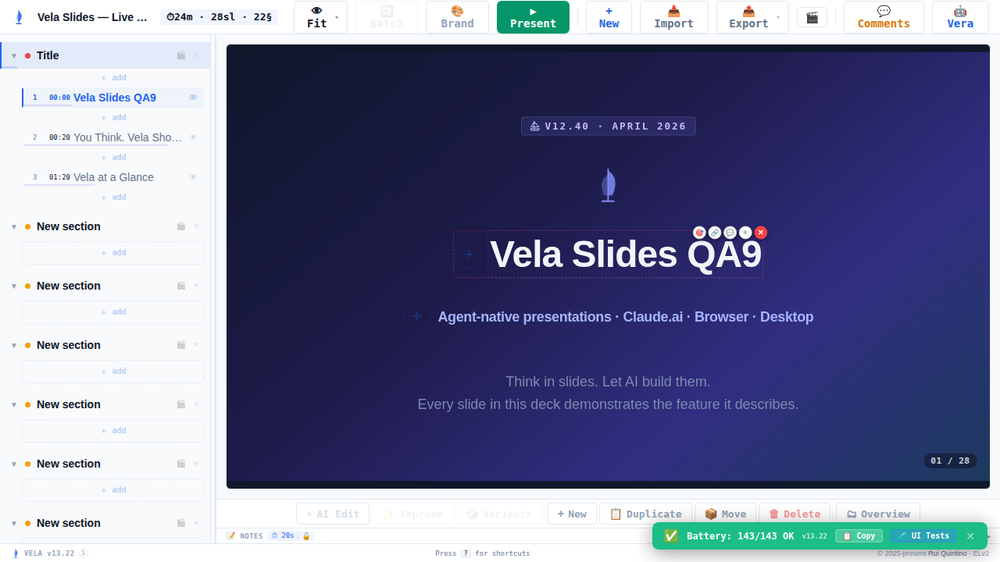
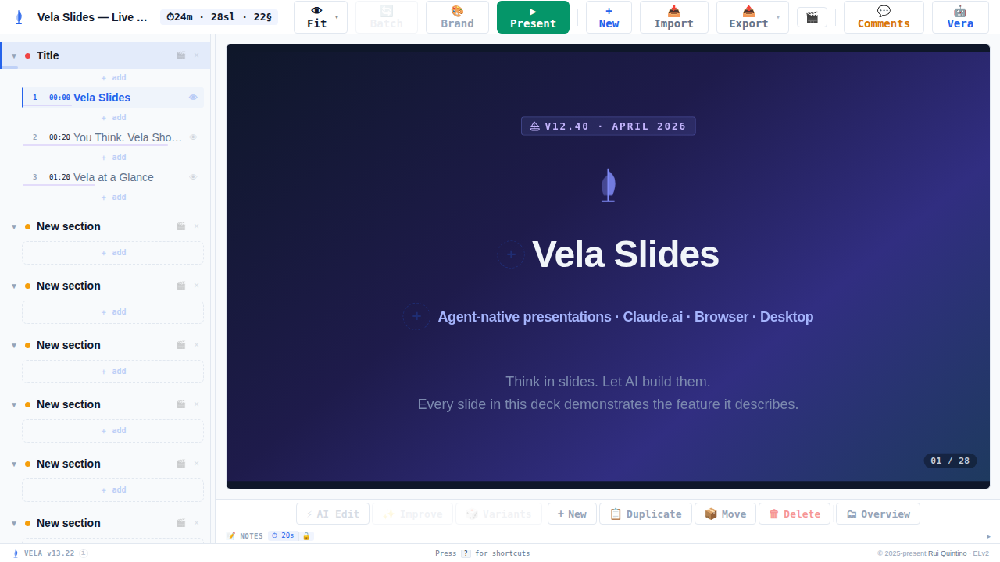

# Sprint "palisade" — deck-data hardening (v13.22)

**Date:** 2026-08-08 · **Branch:** `claude/harden-deck-data-ingress-7uoi4p` (base `ux-updates-15`, PR #115)
**Outcome:** ✅ All 7 phases landed · blind gate clean (zero in-scope defects) · no functional regressions.

A defense-in-depth pass over every place untrusted deck data enters the app: ingress
allowlisting, a hardened CSS sink, desktop save integrity, test-hook removal from the
shipped bundle, script-injection escape parity, and CI guards that keep all of it from
regressing.

## Scope — 7 phases

| Phase | Area | What changed (high level) |
|---|---|---|
| 1 | Deck-data ingress | Sanitizers build from explicit `SAFE_SLIDE_KEYS`/`SAFE_BLOCK_KEYS` allowlists instead of copying input; underscore-prefixed keys dropped (reserved renderer-private namespace); numeric layout fields typed + clamped at ingress and at the `imageCols` sink; sanitizer recursion depth-capped. Engine slide-key lists derived from the allowlist (one source of truth). |
| 2 | CSS accent sink | `--vera-accent` routed through the color encoder and type-registered via `@property { syntax:"<color>" }`, with `var()` fallbacks kept at both consumption sites. |
| 3 | Desktop shell (Neutralino) | Read-back save verification (tri-state verified/mismatch/unknown); exact-text watcher echo guard; 400 ms ignore window; size-capped, stat-before-read watcher through one audited FS entry point; basename-only status payloads; no-arg `flushNow`. |
| 4 | Build hygiene | Four window test hooks collapsed into one runtime-gated `__velaTestHooks`; save-status wiring gated; opt-in `concat.py --release` strips the dev-only block from the shipped bundle (committed template stays the dev build, byte-identical to default concat). |
| 5 | Script injection | Marker substitution uses the replacer-function form everywhere (no `$`-pattern splicing); U+2028/U+2029 escaped; one shared `escapeForScriptContext()` mirrors the Python helper across all JS injectors. |
| 6 | CI | Key-drift lint (fails the build when a renderer reads a key the allowlist misses) + release-build hardening assertions wired into `ci.yml`. |
| 7 | Docs + release | `docs/SECURITY.md` posture, `block-schema.md` notes, `VELA_VERSION` → 13.22, changelog, `SKILL.md` synced. |

## Agentic burndown



Work-remaining = open change-requests + agent-found defects. The blind round adds scope
(the bump) before returning to zero: blind round 1's ingress+CSS verifier came back
**inconclusive** — a harness-timing artifact (no pre-warmed server + too-short deadline +
the slow in-app battery run concurrently with polls corrupted state), not a defect. Re-run
as **V1b** with a warmed server and realistic deadline: **PASS**, gate clean.

## Verification

**Local gate (all green on the integrated branch):**
- `python3 tests/test_vela.py` → **480 passed** (baseline 430; +50 new hardening/parity/allowlist assertions)
- All 24 Node `.cjs` suites green, including the new `test_deck_key_allowlist.cjs` (73), `test_release_build.cjs` (14), and the extended `test_css_exfil.cjs` (82) and `test_deck_io_save.cjs` (18)
- `concat.py` template in sync; `concat.py --release` bundle greps **0** `__velaTest`; default build byte-identical to the committed template
- `lint.py --parts` clean (0 errors)

**Blind gate — 4 independent best-model validators, blind to sprint history, engine-enforced deadlines:**

| Validator | Scope | Verdict |
|---|---|---|
| V1b | Deck rendering after allowlist + CSS accent | **PASS** — every slide visually identical to base render; split layouts populated, custom SVG not stripped, editor round-trip preserves all blocks, present-mode title card intact, accent unchanged |
| V2 | Desktop save integrity + injection parity | **PASS** — tri-state verify confirmed by code reading; hostile-content deck boots intact (`__velaBooted` true, no breakout, deck text uncorrupted, escapes applied); Python↔JS escaper byte-parity |
| V3 | Test-hook strip + UI battery | **PASS** — default load exposes no test surface; gate works both directions; release strip real; UI battery **219 pass / 3 known-pre-existing fail / 0 other** |
| Broad hunter | Whole-app cross-cutting | **CLEAN** — presenter nav, editing, gallery (28 slides), in-app battery 143/143, no in-scope defects |

**Regression coverage:** a dedicated analyst produced a 25-scenario (9 P0) regression plan
before implementation and independently inventoried the keys most likely to silently
disappear from an allowlist (`_virtual`, `layout`/`L`/`R`, `notes`, `timeLock`, `imageCols`).
Those findings were steered into the implementation and re-checked at the gate. Baseline UI
battery (219 pass / 3 known-fail / 9 AI-skips) was matched exactly after every merge — no
feature regressed.

## Before / after

The changes are non-visual hardening — the app should look and behave identically. That is
the point of the before/after pairs: proof nothing regressed.

| | Before (v13.21 base) | After (v13.22 gate) |
|---|---|---|
| Editor |  |  |
| Gallery (28 slides) |  |  |
| Two-column split layout | — |  |
| Custom SVG (not stripped) | — |  |
| Timeline (accent color) | — |  |
| Present-mode title card | — |  |
| Editor round-trip (all blocks preserved) | — |  |
| Test hooks gated (dev mode on) | — |  |

## Bugs found & fixed during the sprint

- **`.map(sanitizeBlock)` index-as-depth** — a bare `.map(sanitizeBlock)` would have passed
  the array index as the recursion-depth argument, silently dropping every slide's 5th+
  block once the depth cap landed. Caught during implementation, fixed, locked by tests.
- **`_virtual` forgery surface** — the virtual title-card flag is derived at render time and
  never persisted, so stripping all underscore keys at ingress is correct *and* closes a
  path where a deck could fake the flag to suppress branding / the slide counter.
- **css-exfil test slice** — integration surfaced that the exfil suite's extracted
  `sanitizeSlide` slice needed the new allowlist/clamp definitions; fixed at merge, suite green.
- **Blind round-1 harness timing** — the ingress+CSS verifier's inconclusive first run
  (not a product bug) drove a harness-protocol fix (warm-first, no concurrent polling) for
  the re-run.

## Cost

Full sprint (orchestrator + all workers, recon, readiness, regression analyst, and the blind
gate incl. the V1b re-run): **$105.83** across 15 agent transcripts (opus $96.41 / sonnet
$9.42). 97% of tokens were cache-reads. The orchestrator hub stayed thin — zero images
pinned, all screenshots looked at inside the validator sub-agents and only their one-line
verdicts read into the hub.

## Commits (7, on the sprint branch)

```
docs(release): v13.22 — hardening changelog, security posture, schema notes
ci: key-drift lint + hardening assertions
harden(deck): allowlist slide/block keys, reserve internal namespace, bound recursion
harden(build): strip test hooks from the shipped bundle
harden(inject): replacer-function marker substitution and escape parity
harden(desktop): read-back save verification, exact echo compare, bounded deck reads
harden(css): encoder-gate and type-register the accent custom property
```

## Deliberately excluded (flagged for the maintainer)

- **Desktop `<meta>` CSP asymmetry** — the Neutralino shell still allows `https:` in
  `img-src`/`font-src`, so the deck sanitizers are the sole backstop for image/font beacons
  there. Pre-existing, out of this branch's scope, real regression risk for existing decks.
  Recommend a separate scoped phase.
- **No recorded demo deck** — the stop rule's optional video artifact was skipped: these are
  non-visual hardening changes, and the before/after screenshots already prove no regression.
