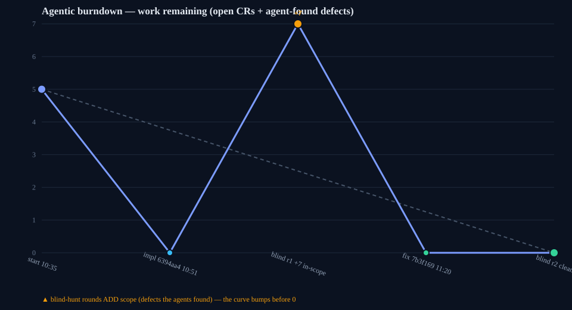
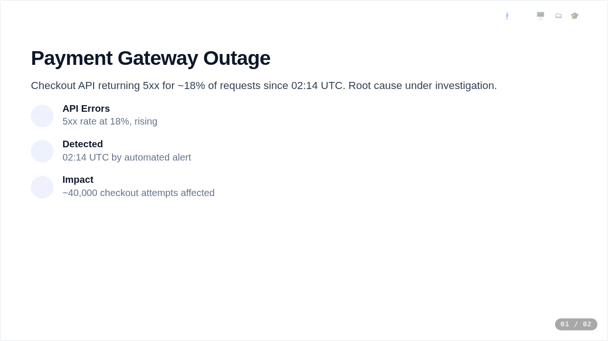
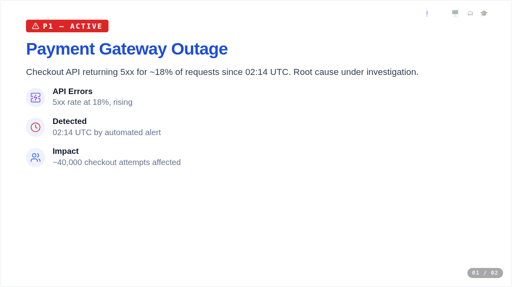
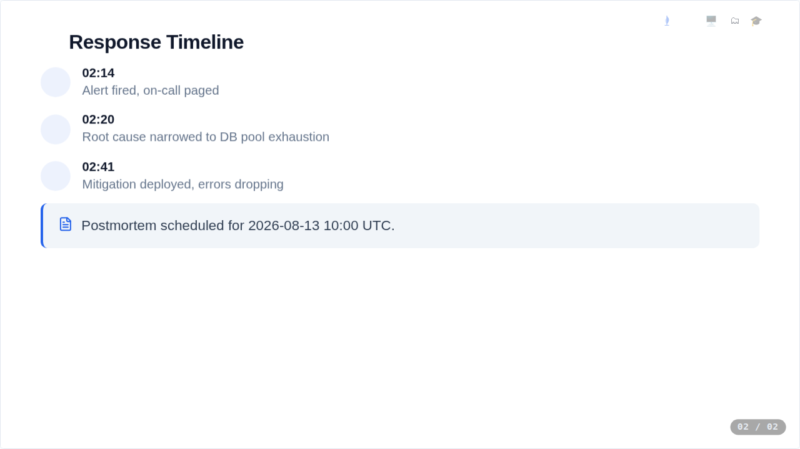
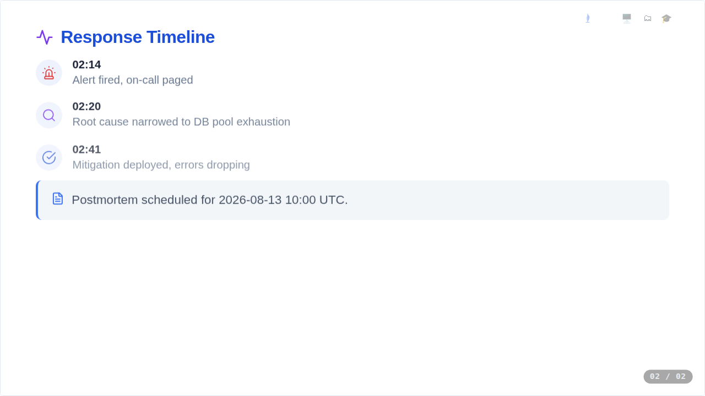

# Sprint "sigil" — palette resolution fails silently and ships broken decks

**Date:** 2026-08-12 · **Branch:** `claude/palette-resolution-silent-fail-c67wj9` (base `main` @ `527b94a`) · **Version:** v13.46
**Change request:** LLM-authored compact decks writing palette keys without the `$` sigil (`"C":{"A":"#3B82F6"}`) had the whole palette silently discarded — every `$A…$Z` reference shipped as a literal string, rendering invisible headings and invisible icons, while `deck validate` and `deck ship` reported success.

## Scope

| # | Item | Outcome |
|---|---|---|
| A | Sigil-sensitive palette filter silently drops bare keys | Fixed — bare 1–2-letter keys normalise to `$`-form with a stderr warning; unusable `C` is a hard error |
| B | No detection of unresolved `$X` tokens after expansion (load-bearing) | Fixed — exact-token detection fails `expand`/`ship`/`assemble`/`validate` with exit 4, JSON paths listed, no artifact written; `--allow-unresolved` escape hatch |
| C | `validate.py` never expanded sectioned (`G`-form) compact decks | Fixed — shared `is_compact` predicate; identical slide/block counts across full/S/G/turbo forms |
| 4.3 | Resolved-colour CSS-grammar sweep | Added — warnings only, never blocks a ship |
| 4.5 | Docs (`SKILL.md`, `formats.md`, `deck init` docstring + normalisation) | Done — `deck init`'s own docstring was a live generator of this bug (bare-key example, G-form output) |

## Agentic burndown

Implementation drove the 5 planned changes to zero by commit `6394aa4`; blind round 1 then **added 7 in-scope defects** (the bump — 12 findings, 5 verified pre-existing at base), fixed in `7b3f169`; blind round 2 came back clean.

## Before / after

The exact incident fixture ([fixture-incident.json](fixture-incident.json), bare `C` keys) shipped through the pipeline at base vs. at HEAD:

| Before (base `527b94a`) | After (HEAD `7b3f169`) |
|---|---|
|  |  |
|  |  |

Before: the "P1 — ACTIVE" badge is invisible, icon rows render as empty grey circles, the heading's icon is missing — while `deck validate` printed `✅ Deck is valid` ([before-cli.txt](before-cli.txt)). After: colours and icons fully restored via key normalisation (with warnings), and an undefined-alias variant hard-fails with exit 4, the offending JSON path named, and no artifact written ([after-cli.txt](after-cli.txt)). All four screenshots were frame-checked by the capturing agents.

## Verification (stop rule)

- **Blind round 1** (fresh best-model agents, spec + HEAD only, no sprint history): acceptance verifier — all 7 criteria PASS; adversarial hunter — 12 findings.
- **Triage:** 7 in-scope (new-code hardening gaps), 5 suspected pre-existing — each **verified reproducing at base `527b94a`** in a worktree before being classified out of scope.
- **Fix round** (`7b3f169`): all 7 in-scope defects fixed with regression tests.
- **Blind round 2** (fresh agent): all acceptance criteria + all hardening spec bullets PASS via real CLI probes; extended adversarial hunt — **zero in-scope defects**. Gate closed.
- *Deviation from the repo's default stop rule:* this CR's surface is the build-time CLI (Python), not the browser app — the blind rounds drove the real CLI rather than the `burst-bug-hunter` browser engine, and the proof artifact is this report (browser used only for the before/after renders above). No app-code behaviour changed (version constant only).

## Bugs found & fixed in the blind rounds

| Defect | Fix |
|---|---|
| Partial-overlap alias (`$AB` with only `$A` defined) mangled by substring substitution, bypassing the hard gate — broken artifact shipped with exit 0 | Exact-token substitution (`\$[A-Za-z]{1,2}` with letter boundary); undefined tokens reach the gate intact |
| `studyNotes.glossary` values (dict nesting) lost the prose exemption — substituted on expand, hard-flagged by validate | Text-subtree exemption now persists through dicts and lists at all depths, for substitution and both sweeps |
| `validate.py` ignored `--allow-unresolved`, double-reported aliases, and cascaded bogus errors (missing title / no lanes / 0-slide stats) on expand failure | Flag parsed and propagated; expand failure reports only the expand error; parity with `vela deck validate` |
| `"A"` and `"$A"` both present with different values: silent last-writer-wins | Hard error (ambiguous); identical values collapse to one entry with one warning |
| Degenerate keys accepted: `""` normalised to `"$"`, and a `"$"` key rewrote every literal dollar sign in non-prose strings | Palette keys must match `^\$?[A-Za-z]{1,2}$`; everything else ignored with a warning |
| `expand_deck` mutated its input (popped `C`; second call errored) | Deep-copies before reading (pop predates this sprint; consequences were new) |
| Full-format deck with a top-level `C`: palette ignored, then a misleading "define it in palette 'C'" error | Full+`C` decks run the same normalise→resolve→gate pipeline everywhere `_load_full` is used |

## Threat-model security pass (post-implementation)

A deep threat-model review of the change (blind reviewer, full `vela-secure-coding` skill as checklist, exercising adversarial decks — not just reading) covered nine vulnerability classes. **Zero newly-introduced vulnerabilities or bad practices:**

- **ReDoS** — all four new regexes proven linear (worst ~11 ms at 500 K chars, O(n)); no catastrophic backtracking in the colour grammar.
- **Fail-open** — the unresolved-alias gate raises before any write; exit 4 + no artifact proven on ship/assemble/validate.
- **Injection** — normalisation/substitution preserves the render-side `cssColor`/`cssGradient` boundary (untouched); crafted palette values (`#fff;}*{…}`, `expression()`, `</script>`) still rejected at render. The colour-grammar sweep is explicitly warning-only, not mistaken for a control.
- **Alias correctness** — exact-token substitution genuinely closes the substring-mangling class; no `$`-token can survive into a shipped colour past the gate.
- Mutable global, path/file handling, disclosure discipline, general practices — all SAFE.

The review surfaced **three fail-closed hardening items** (two flagged initially, a third by the independent re-verify), all corrected in this sprint:

| Item | Severity | Pre-existing? | Fix |
|---|---|---|---|
| `validate.py` reported a full-format deck (unresolved `$X`, no `C`) **valid** when the `vela` import degraded — genuine **fail-open** in a security gate | Medium | Yes | Import failure now populates the error list and refuses to validate without the alias gate (exit 1, never "Deck is valid") — commit `ab8a3a0` |
| Tree-walk recursion unbounded (fail-closed only because `json.load` tripped first) | Low | Yes | `RecursionError` at the `expand_deck`/gate boundary → clean `DeckExpandError` — commit `ab8a3a0` |
| Deep on-disk deck still dumped a **raw traceback** — the guard sat after parse, but `json.load` at the CLI entrypoints blew the stack first (~247 levels) | Low (no data-integrity breach — no artifact written) | Yes | Guard moved to the JSON-parse boundary in both entrypoints; clean "too deeply nested" error; regression test drives the **real file-based CLI** (the path prior in-memory tests missed) — commit `280a21f` |

Each fix was independently blind-verified (fail-closed behavior confirmed, happy-path byte-identity preserved). Suites after the pass: `test_vela.py` **537**, `test_cli.py` **75**.

## Pre-existing issues (verified at base, out of scope — follow-up candidates)

- Compactor aliases repeated hex **inside prose text fields** → full→compact→expand corrupts prose to `$A` (the prose exemption then correctly refuses to touch it).
- Substitution reaches non-prose strings (table headers/cells, comparison items, image `src`) containing alias-like text.
- Turbo round-trip drops cols-layout `L`/`R` content and slide layout keys; `deck compact` drops deck-level `branding`/`author`.
- `deck compact` on turbo input and empty `[]` decks raise raw tracebacks instead of `_err` exit codes.
- Global flags (`--json`/`--dry-run`/`--allow-unresolved`) are stripped even from positional argument values.
- Standalone `assemble.py` (not the documented `vela deck ship`/`assemble` path) performs no expansion or gating.
- CLAUDE.md's "361 tests" figure is stale (suite reports 534).

## Stats

| Metric | Value |
|---|---|
| Commits | 5 (`3f56ae6` plan · `6394aa4` implementation · `37359c8`/`e4f463e` proof assets · `7b3f169` fix round) |
| Tests | `test_vela.py` 503 → **537** · `test_cli.py` 53 → **75** (+56 total, incl. `tests/fixtures/palette-bare-keys.json` incident fixture) |
| Gates | test suites, `concat.py`, `lint.py`, `check-routing.py` all green at HEAD |
| Blind rounds | 2 correctness (round 1: 12 findings → 7 fixed, 5 verified pre-existing · round 2: clean) + a threat-model security pass (0 new vulns, 3 fail-closed hardening items corrected) |
| Commits | `6394aa4` impl · `7b3f169` fix round · `ab8a3a0` + `280a21f` security hardening · plan/proof/report |
| Wall clock | ~10:30–14:xx (plan `10:35` → correctness gate → threat-model pass) |

## Cost

| Agent | Role | Cost |
|---|---|---|
| Implementation worker | 5-part change + 21 tests | $11.70 |
| Orchestrator (hub) | plan / delegate / merge / gate | $9.74 |
| Fix-round worker | 7 defects + base verification | $7.67 |
| Blind round 2 verifier | acceptance + hunt | $5.23 |
| Blind round 1 hunter | adversarial hunt | $4.78 |
| Blind round 1 verifier | acceptance | $2.77 |
| Recon | line-anchored edit map | $2.58 |
| Proof capture (before/after) | renders + frame-checks | $2.63 |
| **Total** | 9 agents, 62.7M tokens (96% cache-read) | **$47.11** |

Hub hygiene held: 0 images pinned in the orchestrator context, 140K peak context, hub = 21% of spend.
