# Sprint "lantern" — 2026-09-18

19 change requests from a Word brief with 9 annotated screenshots, delivered to a clean blind
validation gate. Branch `claude/hyper-sprint-wg4gfj`, base `702256ff`, version 13.74 → **13.76**.

| | |
|---|---|
| Change requests | **19 delivered** — 17 fixed, 2 proven not-a-bug |
| Defects found by validation and fixed | **11** |
| QA reports correctly rejected as misdiagnoses | **4** |
| Tests | **561 → 706** Python · **333** UI battery · **0 failed** |
| Blind rounds | 4 (round 4 clean) |
| Commits | 40 |
| Cost | **$290.38** · 510M tokens · 98% cache-read |

---

## Agentic burndown

Work remaining = open change requests + defects the agents found. Each blind round **adds** scope,
so the curve rises before it reaches zero. That shape is the point: the sprint did not converge
because implementation finished, it converged because a hunt stopped finding things.

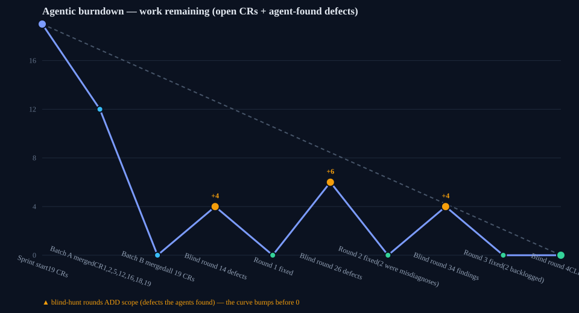

---

## The change requests

| CR | Area | Outcome |
|---|---|---|
| 1 | Deck ingress rewrote lane and module ids | **Fixed.** A bug, not a safeguard — `LOAD` already replaces the whole state, so ids cannot clash. Opening `vela-demo.vela` changed 12 ids; `business-report.vela` now round-trips with **zero** differing fields. Incoming ids become storage keys, so they pass a charset allowlist first. Timestamps were a false alarm: `createdAt` was always preserved. |
| 2 | A gradient in a solid-colour field was dropped in silence | **Fixed.** The sanitizer was innocent; `cssColor` at render has no gradient grammar, returns empty, and falls back to the theme default. `validate.py` now errors and names the field and the remedy. Ten other colour fields share the class. All 6 shipped decks still validate clean. |
| 3 | Image top-aligned beside content | **Not a bug.** The brief asked "may this already be fixed?" — it was. Measured gaps 139/134 px (split) and 125/109 px (cols). |
| 4 | No hide control in gallery | **Fixed.** Hide/unhide beside delete, with a state-correct tooltip. |
| 5 | `€` rendered thin in vector PDF | **Fixed.** Characters outside Latin-1's core were routed to the emoji-bitmap path and measured at a hardcoded 500 instead of the font's metric. Now WinAnsi bytes measured by byte: € takes its real 771/1000. **PPTX was not affected** — the brief's open question, answered with evidence. |
| 6 | Block copy and paste | **Fixed (new).** Session clipboard, a target marker before commit, one undo step, and the payload is re-sanitized — a `javascript:` link does not survive a paste. |
| 7 | Review mode | **Fixed (new).** On-slide checkmark, editor-only filtered cycling, truthful empty states. Presenter still cycles every slide. |
| 8 | Accent bar would not go to 0 | **Fixed.** `b.accentHeight \|\| 4` — `0` is falsy, so a deliberate 0 always repainted the 4 px default. Type-checked, and the element is now absent at 0. |
| 9 | Branding panel felt unprofessional | **Fixed.** A right-hand pane with the canvas visible beside it, so a change is seen as it is made. Type at 13 px and above. |
| 10 | Gallery icon invisible | **Fixed.** Not missing — `background: transparent`, so contrast depended on whatever the slide painted behind it. Now a fixed chip: 4.17:1 over white, 19.87:1 over black. |
| 11 | Presenter edit icon intermittent | **Fixed.** Same root cause as CR10, which is exactly why it was "sometimes visible". |
| 12 | HTML export: duplicate `useState` | **Fixed.** `sync-vela.py` baked a shim into `resources/vela.jsx`, then the exporter prepended its own. The shim moved into `nl-boot.js`. |
| 13 | View switching was hidden | **Fixed.** An Editor/Gallery switcher beside Present, keyboard reachable, with the old entry point kept working. |
| 14 | No slide delete in the outline | **Fixed.** Matches the section control and is undoable. |
| 15 | Block toolbar clipped on a full-bleed block | **Fixed.** Chrome measures free room on hover and clamps inward. Verified at all four edges. |
| 16 | Window title lacked the deck name | **Fixed.** `Vela Slides - <deck title>`, rebuilt from the deck so the prefix cannot stack; 14 inputs checked including repeated prefixes and a 300-character title. |
| 17 | Link marks overlapped or drifted right | **Fixed.** The mark was absolutely positioned in the item box corner, and the box tracks the **widest** line — hence both reported symptoms. Now an inline suffix of the label. 11 stress shapes measured, including a 7-line wrap. |
| 18 | Keyboard dead after alt-tab | **Fixed.** No focus-regain handler existed; `#root` is refocused on native window focus. |
| 19 | AI offline until a full restart | **Fixed.** Not a plain startup race — a dead gatekeeper could leave a stale unkeyed handshake pair that got cached and cleared only on a 401, so the dead port survived every retry **and** the rescan. That is precisely why only a restart worked. |

---

## Before and after

Screenshots were captured by the blind verifiers while they drove the app, and each one was looked at
before it was kept. "Before" comes from a render of the base commit driven the same way.

# Sprint lantern — before / after screenshots

This file is a fragment. Its image links use the path `img/<name>.png`, so put
the text into a document in the parent folder
(`.hyper-sprint/completed/2026-09-18-lantern/`).

All shots come from the offline render harness at a 1280x720 window, unless a
section tells you a different width. "Before" is the sprint base commit
`702256ff`. "After" is the sprint head. Some shots are zoomed. A zoomed shot
keeps the true pixels of the app; only the scale is larger.

Two changes are new features (CR7 review mode and CR6 copy and paste). A new
feature has no "before" state, so these two sections show "after" shots only.
Each such section says so.

## CR4 — Hide control in the gallery row

| Before | After |
|---|---|
| 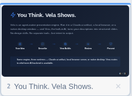 |  |

The pointer is at the same position in both shots. Before, the slide row has
only the delete control (x). After, an eye control is beside the delete
control. The eye control hides the slide and shows it again.

## CR10 / CR11 — Top-right controls in the presenter

| Before | After |
|---|---|
|  |  |

The shots show the top-right corner of a slide in the presenter. Before, the
gallery control (the folder shape) is almost the same color as the slide
behind it. The edit control (the pencil) has no background of its own. After,
both controls sit on a dark chip. The gallery glyph is white. The controls are
readable on any slide.

## CR13 — Editor / Gallery switcher in the header

| Before | After |
|---|---|
| 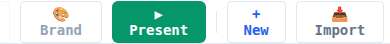 | 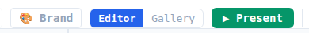 |

Before, the header has no view control between "Brand" and "Present". After, an
"Editor | Gallery" switcher is beside the "Present" control.

## Header and bottom toolbar at a 600 px window width

| Before | After |
|---|---|
| 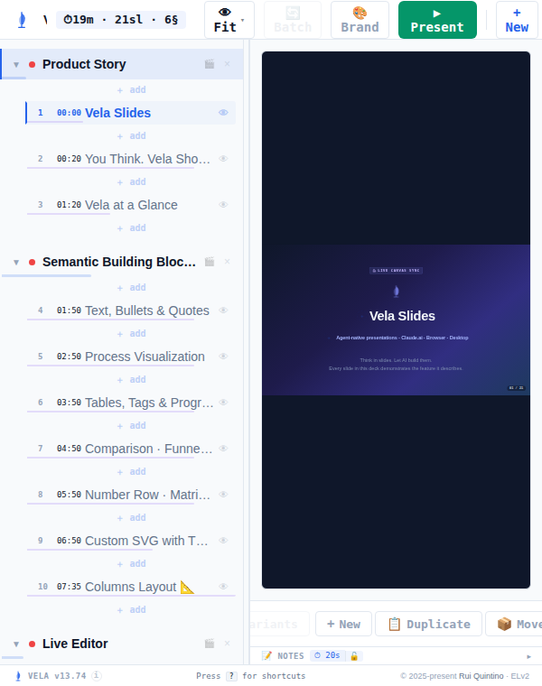 | 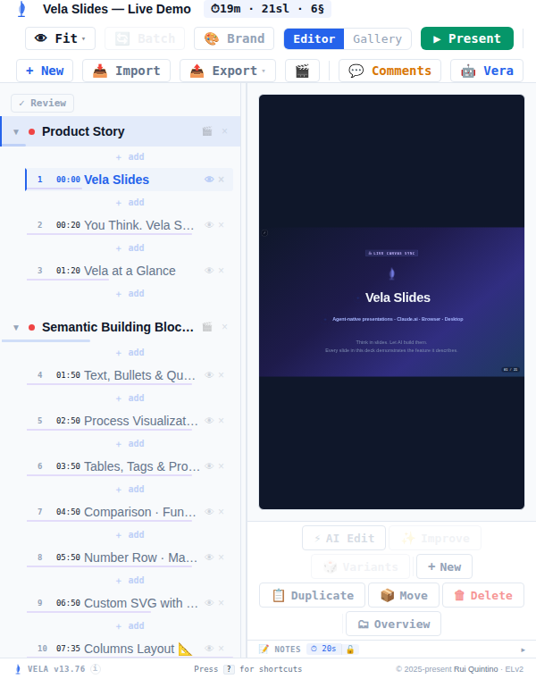 |

The window is 600 px wide in both shots. Before, the header controls after
"New" are outside the window, and the bottom toolbar is cut at both edges. A
measurement in the same run found 8 controls outside the window: Import,
Export, the tour control, Comments, Vera, Move, Delete and Overview. After,
both rows wrap, and the same measurement found 0 controls outside the window.

## CR8 — Accent bar at height 0

| Before — height 0 | After — height 0 | After — height 6 px |
|---|---|---|
| 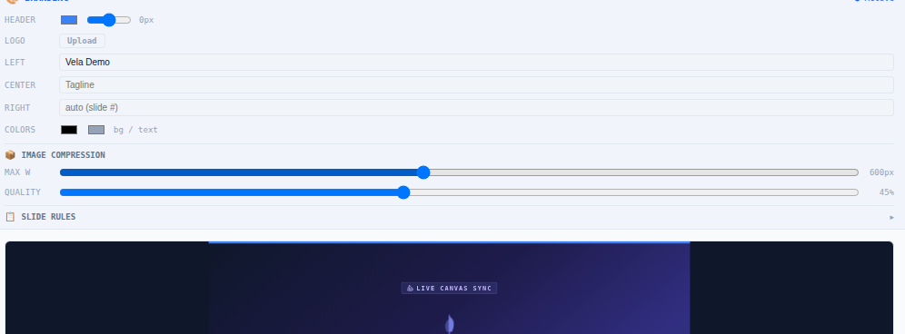 | 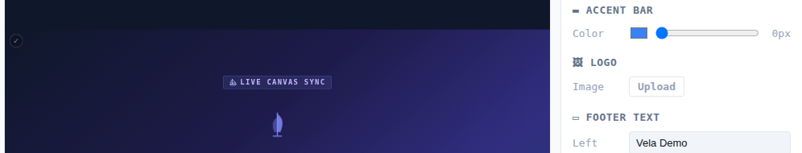 | 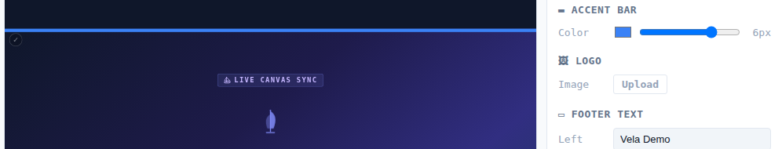 |

In the first shot the branding readout shows "0px", but a blue bar is still
across the top of the slide. In the second shot the readout shows "0px" and no
bar is on the slide. The third shot shows the same build at 6 px, where the bar
is present. The bar is thus fully controlled by the height value.

## CR9 — Branding settings in a right-hand pane

| Before | After |
|---|---|
| 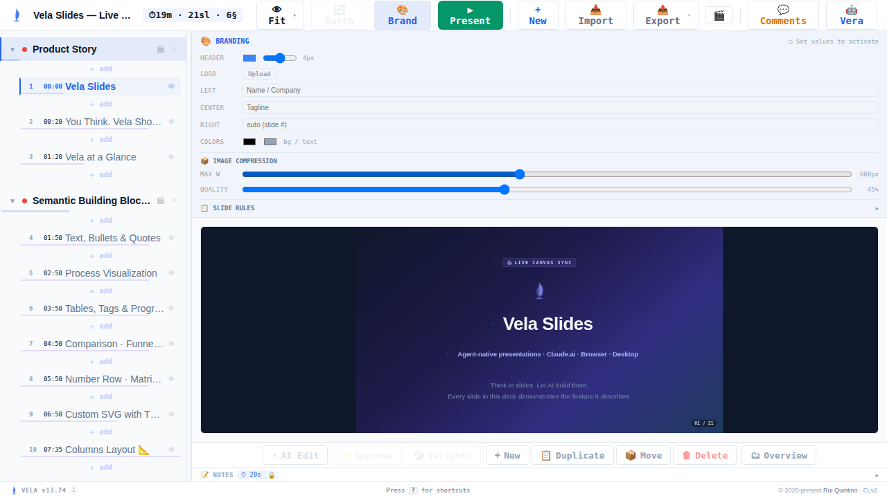 | 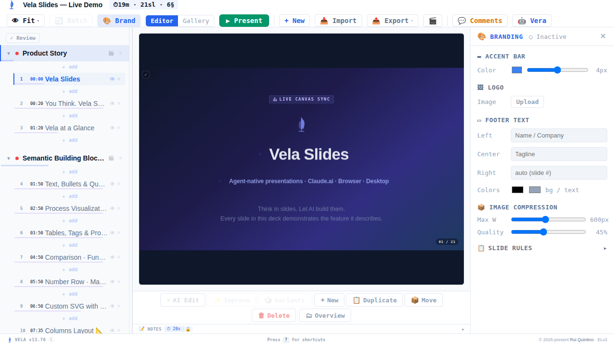 |

Before, the branding settings are a full-width strip below the toolbar, and
they push the slide down. After, the settings are a pane on the right side. The
slide stays beside the pane, so you see the effect of each setting immediately.

## CR7 — Review mode (new feature — after only)

This feature is new. There is no "before" state.

| Not approved | Approved |
|---|---|
| 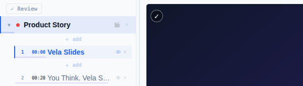 | 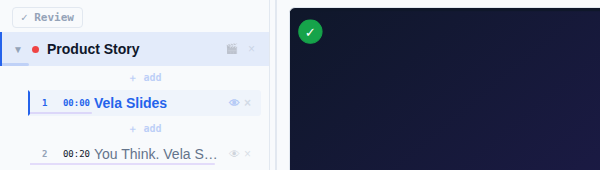 |

A check control is at the top-left corner of the slide. The control is a thin
outline when the slide is not approved. The control is a green disc when the
slide is approved. The "Review" control is at the top of the slide list.

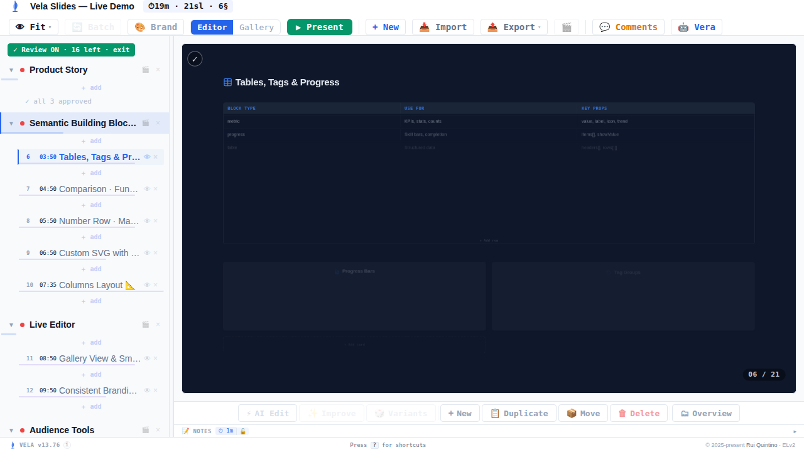

Review mode is on in this shot. The control reads "Review ON · 16 left · exit".
The approved slides are no longer in the list. The "Product Story" section
reads "all 3 approved".

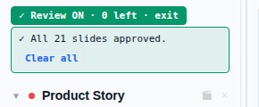

When you approve all slides, a banner reads "All 21 slides approved." The
"Clear all" control in the banner removes all approvals.

## CR14 — Delete control on a slide row of the outline

| Before | After |
|---|---|
| 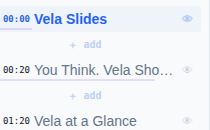 | 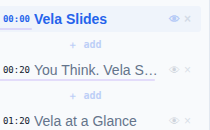 |

The shots are a 6x zoom of three slide rows in the outline. Before, each row has
only the eye control. After, each row also has a delete control (x), the same
control that a section row already had.

## CR15 — Block toolbar on a full-bleed block

| Before | After |
|---|---|
| 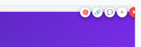 | 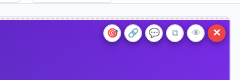 |

The shots are the top-right corner of a slide that one image fills. Before, the
toolbar is above the top edge of the slide and past its right edge. A
measurement in the same run gave a toolbar top of 59 px against a slide top of
67 px. After, the toolbar moves inward and is fully inside the slide: a toolbar
top of 77 px against a slide top of 73 px.

## CR17 — Link mark on a label that wraps

| Before | After |
|---|---|
| 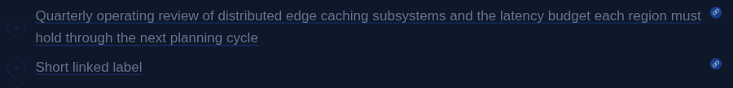 | 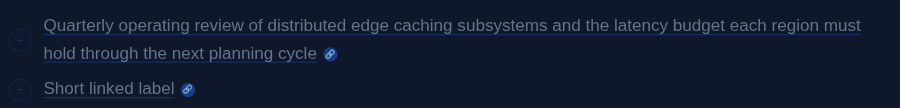 |

The first bullet has a long linked label that wraps to two lines. Before, the
link mark is at the right edge of the block, at the vertical centre of the
paragraph. It has no relation to the text. After, the link mark is immediately
after the last word of the label, on the last line.

## CR6 — Copy and paste of a block (new feature — after only)

This feature is new. There is no "before" state.

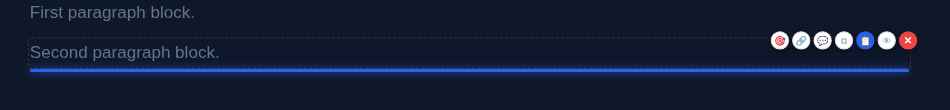

The pointer is on the paste control of the second block. A blue marker line
shows where the copied block will go. The marker is below the block that the
pointer is on.

This is an 8x zoom of the same toolbar. The copy control is the fourth control.
The paste control is the fifth control. The paste control is blue, and it is
present only after a copy.

---

## What the validation gate found

Four blind rounds. Every validator was a fresh agent that saw only the product specification and a
drive recipe — never the diff, the bug count, the elapsed time, or any earlier round's findings.
Time boxes were engine-enforced `deadline` files, not prompt text. The render was rebuilt from the
current HEAD before every round, so no validator could re-find an already-fixed bug in stale code.

### Defects found and fixed — 11

| Round | Defect |
|---|---|
| 1 | Approving slides never drained the queue — the skip helper searched only the **current module's** slide array, so approving a module's last open slide parked the selection and the next click un-approved it |
| 1 | The app displayed an approved slide the filtered list no longer held (same cause) |
| 1 | Hidden slides entered the review rotation, so "N left" could never reach zero on a deck with a hidden slide |
| 1 | Header controls fell outside the window and became unclickable at 500–680 px |
| 2 | Hiding a slide in review mode made its row vanish, so the author could not undo their own hide |
| 2 | The empty-state banner claimed "all approved" on a deck where everything was merely hidden |
| 2 | The Overview control sat outside the window at narrow widths (pre-existing; fixed) |
| 2 | Vector PDF drew non-WinAnsi characters **black on a dark slide** — `renderEmojiToImage` never set `fillStyle`, so every pixel was `(0,0,0)` (pre-existing; fixed) |
| 2 | The link mark on a **wrapped** label floated at the paragraph's vertical centre against the block edge |
| 3 | The review keep-mark was keyed by slide index, so an unrelated delete lost the row — the exact defect the mark existed to prevent |
| — | A branding UI test failed because React's `_valueTracker` swallows a same-value slider write. Repaired, then **mutation-checked**: regressing the product code makes both tests fail again, so they are still load-bearing |

One more defect was **self-inflicted**: a union merge dropped a test suite's closing brackets, leaving
the bundle unparseable. The fix added a guard — `concat.py` now parses the built bundle and names the
owning part and line. The existing release-build parse test could not catch this class, because
release builds drop the test-only parts. That guard caught the identical mistake on the very next
merge.

### QA reports correctly rejected — 4

Each of these looked like a real defect in a competent agent's report. Acting on any of them would
have produced a speculative change to a save path, an exporter or a renderer.

| Claim | Reality |
|---|---|
| "The approved flag is not persisted" | A debounced save read too early. The flag was always written. The "false after reload" half was a harness artifact — this offline harness keeps storage per page load, so any reload clears it regardless of app behaviour |
| "Vector PDF truncates text after an unrenderable character" | Nothing was ever lost. `pdftotext` reported the tail out of reading order. The real bug was invisible ink, found only by producing files on **both** commits |
| "The icon-row link mark is misplaced" | The measurement took its reference from the item wrapper, which resolves to the description line. Against the label itself: 6 px gap, correct line, across 5 shapes |
| "A cross-module drag removes the row" | A driver artifact. `MOVE_SLIDE_TO_MODULE` moves the same slide object, so the identity mark survives |

The lesson generalises: **for an exporter, source reasoning is not proof.** Round 1 read the code and
concluded non-WinAnsi characters were "routed to the image path"; round 2 produced a file and called
them dropped; only a fix worker producing artifacts on both commits found that they were drawn
correctly and painted invisibly.

---

## Known open item

**One defect is shipping unfixed**, by decision to close after the final round. It is a gap in this
sprint's own new code, not a pre-existing bug, and it is recorded at
`.hyper-sprint/backlog/2026-09-18-review-pin-comment-actions.md`.

The review keep-mark lives on slide **object identity**. `UPDATE_SLIDE` carries it across a
replacement; the five comment actions build a new slide object and do not. A comment action on a
pinned row will therefore drop that row. Found at source level in the final round and confirmed
directly against `part-reducer.jsx`; not reproduced in a browser.

The recommended fix is to change the shape rather than patch five call sites — one reducer helper
that replaces a slide and preserves its marks. The present design asks every future author to
remember an invisible rule, which is how the gap appeared.

## Deliberately out of scope

Real bugs found while hunting, kept out of this sprint under the repo's minimal-diff policy. Each is
in `.hyper-sprint/backlog/`.

- **Comment identity is not allowlisted** (`2026-09-18-comment-identity.md`) — demonstrated data
  loss: comment ids get only a length clamp, and every comment action matches on id equality, so one
  delete on a duplicated id removed two comments (3 → 1).
- **Module move controls are dead** (`2026-09-18-module-reorder-and-gallery-count.md`) — `REORDER`
  swaps only inside one lane while the deck stores one module per lane, and the glyph never disables
  itself. Dragging the same row works, which proves the click path is the broken one.
- **The gallery count keeps hidden slides** (same file) — gallery says 21, the header and every
  export say 20.
- **Review-flag semantics and two harness defects**
  (`2026-09-18-review-and-harness-notes.md`) — an approval survives a content edit; `vrun --reset` is
  silently ignored after a job path; and the `galleryState` verb reads two test-ids that **exist
  nowhere in the source**, so it always returns `0`. That last one is the dangerous one: it returns a
  plausible wrong number, and two hunters nearly filed a false finding on it.

---

## Cost

**$290.38** across 31 agent transcripts — opus $264.75, sonnet $25.63. 510M tokens, of which
**98% were cache-reads**: context pinned in an earlier turn and re-billed on every turn since.

What worked: the orchestrator stayed **~14% of spend with zero images pinned**, held from the
mid-sprint checkpoint to the end. Every screenshot lived and died inside a verifier's context. The
skill's reference case had an orchestrator at 65% of spend with screenshots as its single largest
bucket.

What did not, and is worth fixing before the next sprint:

- **Every worker overran the repo's 50-tool-call restart budget by 2–3×** (133–247 calls). Quality
  held, so the budget is the thing that is wrong, not the workers. A limit nothing respects is not a
  limit.
- **The harness blocked every worker from writing its report file**, so each returned full detail
  into the orchestrator's context instead of a pointer. Peak standing context reached 336K tokens,
  and every later turn re-read it. This is the single clearest cost regression of the sprint, and it
  was structural rather than a judgement error.

## Environment limits recorded, not worked around

- **No desktop window can run here**, so CR16 and CR18 are proven by executing the real title and
  focus logic plus source assertions, not by a driven window. CR12 and CR19 **are** execution-proven
  (a real export is built and booted; the handshake is driven through stale-pair and dead-port
  scenarios). `vela-neutralino/SECURITY.md` asks for a manual desktop smoke test after any boot-script
  change, and this sprint changed one. **A human should confirm on a real build:** title follows the
  deck, keyboard responds straight after alt-tab, AI is online on first launch, and Export → Standalone
  HTML opens.
- Three browser E2E stacks in `ci-local.sh` cannot run here (`Missing dep: npm install react`); react
  is vendored and must never be installed. Pre-existing, and `ci-local.sh` still exits 0.
- Standalone-HTML export is correctly gated in the offline harness — *"Babel not available in this
  runtime"*. Coverage comes from a committed test that builds and boots a real export.
