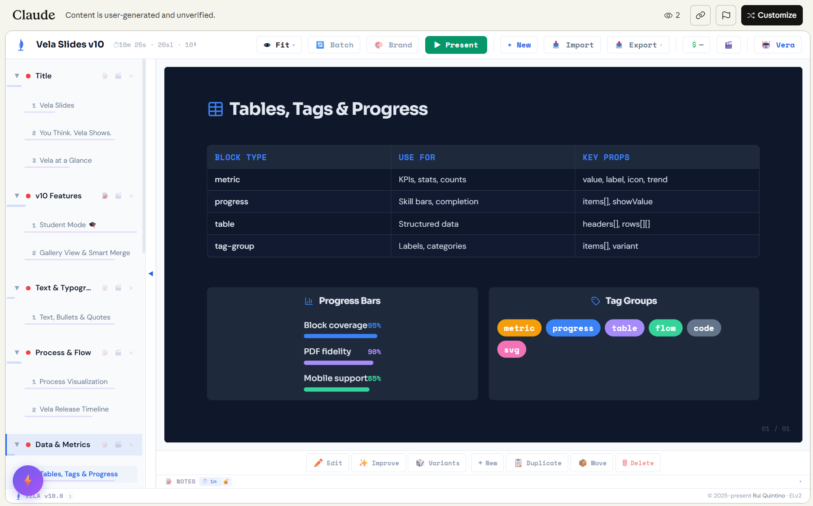

<div align="center">

# ⛵ Vela Slides

**AI-native presentation engine for Claude.ai and Claude Code/Cowork**

Create, edit, and present beautiful slide decks — entirely through conversation.

[](LICENSE)
[](https://claude.ai)
[](#use-as-a-claudeai-skill)

[Get Started](#get-started) · [Features](#features) · [Examples](#examples) · [Architecture](docs/ARCHITECTURE.md) · [Dependencies](docs/DEPENDENCIES.md)

</div>

### :warning: This project is 100% vibe coded

> **No human has reviewed the source code.**
>
> Every line of Vela — 12,650+ lines of JSX, Python CLI tools, and build scripts — was generated entirely by AI (Claude). The codebase is validated by extensive AI code reviews, 250+ automated tests, and static analysis, but no human has ever read or audited the code.
>
> **You are responsible for your own review before using this in any production or sensitive context.**
>
> Found something? We have a [security bounty program](docs/SECURITY.md#security-bounty-program).

---



## Get Started

| | Approach | Best for |
|---|----------|----------|
| **Try instantly** | **[▶ Browse the gallery](https://agentiapt.github.io/vela-slides/)** | View sample decks in any browser — no account needed |
| | **[▶ Open the live demo](https://claude.ai/public/artifacts/327281d4-4331-4ff8-bdbf-a436b698fe73)** | Interactive artifact on Claude.ai with Vera AI assistant |
| **Set up for creation** | **[Upload as Claude.ai skill](#1-use-as-a-claudeai-skill)** | Generate decks from conversation on Claude.ai |
| | **[Run locally with Claude Code](#2-run-locally-with-claude-code)** | Full CLI, live preview, file system access |

> The Claude.ai artifact runs entirely in your browser. AI features (Vera chat, batch edit) use your Claude.ai subscription. Vela has no backend and no access to your data. Requires **Settings → Feature Preview → AI-powered artifacts** enabled.

### 1. Use as a Claude.ai Skill

Upload the skill so Claude generates Vela decks from your descriptions:

1. Download **[`vela-slides-skill-v*.zip`](https://github.com/AgentiaPT/vela-slides/releases/latest)** from the latest release (or build a fresh one: `python3 skills/vela-slides/scripts/vela.py deck zip`)
2. In Claude.ai → **Customize → Skills → "+" → Upload a skill** → upload the ZIP
3. Start a conversation: *"Create a 10-slide deck about the future of AI agents"*

Claude will generate structured slide JSON, assemble it into the Vela engine, and output an interactive artifact.

### 2. Run Locally with Claude Code

Full CLI access, live browser preview, file system integration:

```bash
git clone https://github.com/AgentiaPT/vela-slides.git
cd vela-slides
python3 skills/vela-slides/scripts/serve.py examples/starter-deck.json
# → Opens browser at localhost:3030 with live slides
```

With the skill installed, Claude Code can generate, edit, translate, and rebrand decks using the `vela` CLI — saving 80-97% of tokens vs manual JSON editing.

**Channel bridge** (experimental): Connect the browser UI to Claude Code for click-to-edit workflows. See [`skills/vela-slides/channel/README.md`](skills/vela-slides/channel/README.md).

---

## What is Vela?

Vela is a presentation engine that runs inside **Claude.ai artifacts** — the interactive code panels that Claude creates during conversation. Instead of clicking through menus, you describe what you want and Vela builds it.

```
You: "Create a 10-slide deck on the future of AI agents"
Vera: ⛵ Generates structured slides with diagrams, metrics, flows, and timelines
```

The result is a **fully interactive React application** rendered in Claude's artifact panel — complete with presenter mode, PDF export, dark/light themes, drag-and-drop reordering, and a built-in AI chat for iterating on your slides.

### Why Vela?

| Traditional slides | Vela |
|---|---|
| Click. Drag. Format. Repeat. | Describe what you want. Get it. |
| One block type: text box | 21 semantic block types (flows, grids, metrics, timelines, SVG diagrams...) |
| Static once created | Built-in AI assistant for live iteration |
| Separate design step | Design patterns baked in — every slide looks considered |
| Export to PDF requires plugins | Vector PDF export built in |

---

## How It Works

Vela ships as a **Claude.ai Skill** — a structured prompt + reference architecture that teaches Claude how to generate Vela-compatible slide decks and assemble them into runnable artifacts.

```
┌─────────────────────────────────────────────────┐
│  You describe your presentation to Claude        │
│  ↓                                               │
│  Claude generates structured slide JSON           │
│  ↓                                               │
│  Assembly script injects JSON into Vela engine    │
│  ↓                                               │
│  Claude outputs a .jsx artifact you can interact  │
│  with directly in the conversation               │
└─────────────────────────────────────────────────┘
```

The Vela engine is a **12,650+ line React application** that renders entirely inside Claude.ai's artifact sandbox — no servers, no deploys, no accounts. Your data stays in your conversation.

---

## Features

### 21 Semantic Block Types
Headings, bullets, flows, grids, metrics, timelines, steps, tables, callouts, quotes, SVG diagrams, icon rows, tag groups, progress bars, badges, images, code blocks, and more. Each with semantic properties — not just text boxes.

### Vera — Built-in AI Assistant
An agentic AI chat panel inside the slide engine. Vera can search your deck, batch-edit across slides, restyle sections, add slides from descriptions, and improve designs — all through conversation within the artifact.

### Presenter Mode
Fullscreen presentation with font scaling, keyboard navigation, and speaker notes. Designed for 16:9 projection.

### Vector PDF Export
Canvas-rendered PDF output with clickable links, branding overlays, and watermarks. Every slide exports as a crisp vector page.

### Dark & Light Themes
Full dark/light mode with 7+ theme directions (midnight, warm, editorial, minimal, vibrant). Themes propagate to all block types including SVG diagrams via token injection.

### Persistent Storage
Decks save across sessions using Claude.ai's artifact storage API. No manual export needed to keep your work.

### WYSIWYG Editing
Click any text on a slide to edit it inline. Supports bold, italic, and markdown formatting.

### Drag & Drop
Reorder slides and modules by dragging. Reorganize your deck structure without leaving the artifact.

---

## Examples

### Generate a deck from a topic

```
Create a 12-slide presentation on "The Rise of Agentic AI"
with sections: Introduction, Core Patterns, Architecture, Case Studies, Future
```

### Import and iterate

```
Here's my existing deck JSON. Can you:
1. Add a new section on "Security Considerations"
2. Restyle all slides to use a midnight blue theme
3. Make sure every slide has timing estimates
```

### Use Vera inside the artifact

Once a Vela artifact is running, click the Vera button to open the chat panel. You can ask Vera to modify slides, search content, batch-edit, or generate new slides — all without leaving the artifact.

### Live Demo

Try the self-demonstrating deck — slides that showcase every block type, with Vera ready for hands-on editing:

**[▶ Open Vela Slides v12 Live Demo](https://claude.ai/public/artifacts/327281d4-4331-4ff8-bdbf-a436b698fe73)** · [`skills/vela-slides/examples/vela-demo.json`](skills/vela-slides/examples/vela-demo.json)

See [`examples/`](examples/) for themed sample decks (startup pitch, tech talk, course, business report).

---

## Repository Structure

```
vela-slides/
├── skills/
│   └── vela-slides/          ← Installable skill folder (ZIP for Claude.ai)
│       ├── SKILL.md           ← Skill prompt + workflows
│       ├── app/
│       │   ├── parts/         ← Modular source (13 part-files)
│       │   └── vela.jsx ← Assembled monolith (auto-generated)
│       ├── scripts/
│       │   ├── vela.py        ← CLI: deck/slide operations + zip
│       │   ├── assemble.py    ← Inject deck JSON → final .jsx
│       │   ├── concat.py      ← Parts → monolith builder
│       │   ├── validate.py    ← Deck JSON quality checks
│       │   ├── serve.py       ← Local dev server with live reload
│       │   ├── lint.py        ← Code linting checks
│       │   └── sync-skill-docs.py ← Sync CLI reference into SKILL.md
│       ├── references/        ← Block schema, design patterns, themes, formats
│       ├── examples/          ← vela-demo.json (bundled demo deck)
│       └── evals/             ← Skill quality test cases
├── docs/
│   ├── ARCHITECTURE.md        ← Technical deep dive
│   └── SECURITY.md            ← Security model + audit
├── examples/
│   ├── starter-deck.json      ← Sample deck JSON
│   └── *.json                 ← Themed example decks
├── evals/                     ← Version benchmarking infrastructure
├── tests/
│   ├── test_vela.py           ← Core engine tests (161 tests)
│   └── test_serve.py          ← Server endpoint & security tests (91 tests)
├── LICENSE                    ← Elastic License v2
├── CONTRIBUTING.md
└── README.md
```

---

## Security

Vela runs entirely in Claude.ai's sandboxed artifact environment. See [docs/SECURITY.md](docs/SECURITY.md) for the full security model, including:

- SVG sanitization (defense-in-depth against XSS)
- Import validation and block-type whitelisting
- Content-length limits on all string inputs
- Stored XSS prevention in the local development server
- No credentials or secrets in the codebase

Found something? We have a [security bounty program](docs/SECURITY.md#security-bounty-program).

---

## Contributing

See [CONTRIBUTING.md](CONTRIBUTING.md) for guidelines. The modular part-file architecture makes it straightforward to contribute to specific subsystems without touching the entire codebase.

---

## License & Commercial Use

Vela Slides is source-available under the [Elastic License 2.0 (ELv2)](LICENSE) — © Rui Quintino.

**You can freely use Vela to create, present, and export slide decks for any purpose — personal, commercial, client work, workshops, conferences.** Your content is yours. No attribution required on your decks.

ELv2 restricts three things: offering Vela itself as a hosted service, removing or obscuring the Vela Slides branding, and removing the copyright notice (© Rui Quintino). These must remain visible in the software.

**Enterprise & White-Label Licensing** — If you want to embed Vela into your own product, rebrand it, or need IP indemnification, reach out: info@agentia.pt

---

<div align="center">

**Built for the Claude.ai ecosystem**

*Vela is Latin for "sail" — because presentations should carry your ideas forward.*

⛵

</div>
